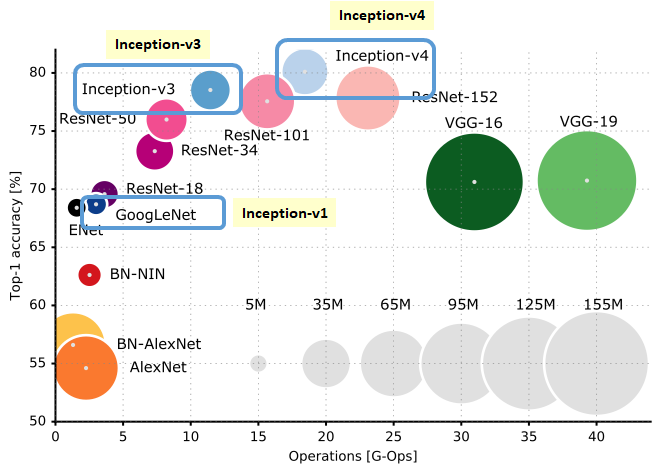
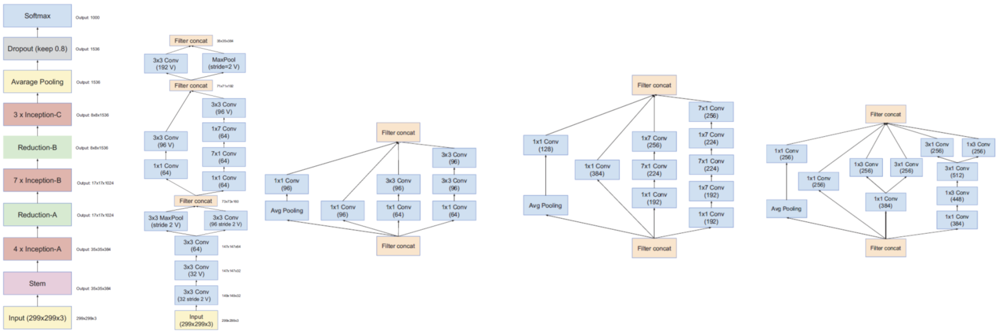

[TOC]

# 第四章 经典网络
## 4.1 LeNet-5

### 4.1.1 模型介绍

LeNet-5是由$LeCun$ 提出的一种用于识别手写数字和机器印刷字符的卷积神经网络（Convolutional Neural Network，CNN）$^{[1]}$，其命名来源于作者$LeCun$的名字，5则是其研究成果的代号，在LeNet-5之前还有LeNet-4和LeNet-1鲜为人知。LeNet-5阐述了图像中像素特征之间的相关性能够由参数共享的卷积操作所提取，同时使用卷积、下采样（池化）和非线性映射这样的组合结构，是当前流行的大多数深度图像识别网络的基础。

### 4.1.2 模型结构

​                                                                 图4.1 LeNet-5网络结构图

如图4.1所示，LeNet-5一共包含7层（输入层不作为网络结构），分别由2个卷积层、2个下采样层和3个连接层组成，网络的参数配置如表4.1所示，其中下采样层和全连接层的核尺寸分别代表采样范围和连接矩阵的尺寸（如卷积核尺寸中的$“5\times5\times1/1,6”$表示核大小为$5\times5\times1$、步长为$1$且核个数为6的卷积核）。

​                                                                 表4.1 LeNet-5网络参数配置

|     网络层      |       输入尺寸       |          核尺寸          |       输出尺寸       |          可训练参数量           |
| :-------------: | :------------------: | :----------------------: | :------------------: | :-----------------------------: |
|   卷积层$C_1$   | $32\times32\times1$  |  $5\times5\times1/1,6$   | $28\times28\times6$  |  $(5\times5\times1+1)\times6$   |
|  下采样层$S_2$  | $28\times28\times6$  |       $2\times2/2$       | $14\times14\times6$  |       $(1+1)\times6$ $^*$       |
|   卷积层$C_3$   | $14\times14\times6$  |  $5\times5\times6/1,16$  | $10\times10\times16$ |            $1516^*$             |
|  下采样层$S_4$  | $10\times10\times16$ |       $2\times2/2$       |  $5\times5\times16$  |         $(1+1)\times16$         |
| 卷积层$C_5$$^*$ |  $5\times5\times16$  | $5\times5\times16/1,120$ | $1\times1\times120$  | $(5\times5\times16+1)\times120$ |
|  全连接层$F_6$  | $1\times1\times120$  |      $120\times84$       |  $1\times1\times84$  |        $(120+1)\times84$        |
|     输出层      |  $1\times1\times84$  |       $84\times10$       |  $1\times1\times10$  |        $(84+1)\times10$         |

> $^*$ 在LeNet中，下采样操作和池化操作类似，但是在得到采样结果后会乘以一个系数和加上一个偏置项，所以下采样的参数个数是$(1+1)\times6$而不是零。
>
> $^*$ $C_3$卷积层可训练参数并未直接连接$S_2$中所有的特征图（Feature Map），而是采用如图4.2所示的采样特征方式进行连接（稀疏连接），生成的16个通道特征图中分别按照相邻3个特征图、相邻4个特征图、非相邻4个特征图和全部6个特征图进行映射，得到的参数个数计算公式为$6\times(25\times3+1)+6\times(25\times4+1)+3\times(25\times4+1)+1\times(25\times6+1)=1516$，在原论文中解释了使用这种采样方式原因包含两点：限制了连接数不至于过大（当年的计算能力比较弱）;强制限定不同特征图的组合可以使映射得到的特征图学习到不同的特征模式。

​                                                                图4.2 $S_2$与$C_3$之间的特征图稀疏连接

> $^*$ $C_5$卷积层在图4.1中显示为全连接层，原论文中解释这里实际采用的是卷积操作，只是刚好在$5\times5$卷积后尺寸被压缩为$1\times1$，输出结果看起来和全连接很相似。

### 4.1.3 模型特性
- 卷积网络使用一个3层的序列组合：卷积、下采样（池化）、非线性映射（LeNet-5最重要的特性，奠定了目前深层卷积网络的基础）
- 使用卷积提取空间特征
- 使用映射的空间均值进行下采样
- 使用$tanh$或$sigmoid$进行非线性映射
- 多层神经网络（MLP）作为最终的分类器
- 层间的稀疏连接矩阵以避免巨大的计算开销

## 4.2 AlexNet

### 4.2.1 模型介绍

​	AlexNet是由$Alex$ $Krizhevsky $提出的首个应用于图像分类的深层卷积神经网络，该网络在2012年ILSVRC（ImageNet Large Scale Visual Recognition Competition）图像分类竞赛中以15.3%的top-5测试错误率赢得第一名$^{[2]}$。AlexNet使用GPU代替CPU进行运算，使得在可接受的时间范围内模型结构能够更加复杂，它的出现证明了深层卷积神经网络在复杂模型下的有效性，使CNN在计算机视觉中流行开来，直接或间接地引发了深度学习的热潮。

### 4.2.2 模型结构

​                                                                         图4.3 AlexNet网络结构图

如图4.3所示，除去下采样（池化层）和局部响应规范化操作（Local Responsible Normalization, LRN），AlexNet一共包含8层，前5层由卷积层组成，而剩下的3层为全连接层。网络结构分为上下两层，分别对应两个GPU的操作过程，除了中间某些层（$C_3$卷积层和$F_{6-8}$全连接层会有GPU间的交互），其他层两个GPU分别计算结 果。最后一层全连接层的输出作为$softmax$的输入，得到1000个图像分类标签对应的概率值。除去GPU并行结构的设计，AlexNet网络结构与LeNet十分相似，其网络的参数配置如表4.2所示。

​									表4.2 AlexNet网络参数配置

|        网络层         |               输入尺寸               |                  核尺寸                  |               输出尺寸               |              可训练参数量               |
| :-------------------: | :----------------------------------: | :--------------------------------------: | :----------------------------------: | :-------------------------------------: |
|   卷积层$C_1$ $^*$    |        $224\times224\times3$         | $11\times11\times3/4,48(\times2_{GPU})$  | $55\times55\times48(\times2_{GPU})$  | $(11\times11\times3+1)\times48\times2$  |
| 下采样层$S_{max}$$^*$ | $55\times55\times48(\times2_{GPU})$  |       $3\times3/2(\times2_{GPU})$        | $27\times27\times48(\times2_{GPU})$  |                    0                    |
|      卷积层$C_2$      | $27\times27\times48(\times2_{GPU})$  | $5\times5\times48/1,128(\times2_{GPU})$  | $27\times27\times128(\times2_{GPU})$ | $(5\times5\times48+1)\times128\times2$  |
|   下采样层$S_{max}$   | $27\times27\times128(\times2_{GPU})$ |       $3\times3/2(\times2_{GPU})$        | $13\times13\times128(\times2_{GPU})$ |                    0                    |
|   卷积层$C_3$ $^*$    |  $13\times13\times128\times2_{GPU}$  | $3\times3\times256/1,192(\times2_{GPU})$ | $13\times13\times192(\times2_{GPU})$ | $(3\times3\times256+1)\times192\times2$ |
|      卷积层$C_4$      | $13\times13\times192(\times2_{GPU})$ | $3\times3\times192/1,192(\times2_{GPU})$ | $13\times13\times192(\times2_{GPU})$ | $(3\times3\times192+1)\times192\times2$ |
|      卷积层$C_5$      | $13\times13\times192(\times2_{GPU})$ | $3\times3\times192/1,128(\times2_{GPU})$ | $13\times13\times128(\times2_{GPU})$ | $(3\times3\times192+1)\times128\times2$ |
|   下采样层$S_{max}$   | $13\times13\times128(\times2_{GPU})$ |       $3\times3/2(\times2_{GPU})$        |  $6\times6\times128(\times2_{GPU})$  |                    0                    |
|  全连接层$F_6$  $^*$  |   $6\times6\times128\times2_{GPU}$   |     $9216\times2048(\times2_{GPU})$      | $1\times1\times2048(\times2_{GPU})$  |       $(9216+1)\times2048\times2$       |
|     全连接层$F_7$     |  $1\times1\times2048\times2_{GPU}$   |     $4096\times2048(\times2_{GPU})$      | $1\times1\times2048(\times2_{GPU})$  |       $(4096+1)\times2048\times2$       |
|     全连接层$F_8$     |  $1\times1\times2048\times2_{GPU}$   |             $4096\times1000$             |         $1\times1\times1000$         |       $(4096+1)\times1000\times2$       |

>卷积层$C_1$输入为$224\times224\times3$的图片数据，分别在两个GPU中经过核为$11\times11\times3$、步长（stride）为4的卷积卷积后，分别得到两条独立的$55\times55\times48$的输出数据。
>
>下采样层$S_{max}$实际上是嵌套在卷积中的最大池化操作，但是为了区分没有采用最大池化的卷积层单独列出来。在$C_{1-2}$卷积层中的池化操作之后（ReLU激活操作之前），还有一个LRN操作，用作对相邻特征点的归一化处理。
>
>卷积层$C_3$ 的输入与其他卷积层不同，$13\times13\times192\times2_{GPU}$表示汇聚了上一层网络在两个GPU上的输出结果作为输入，所以在进行卷积操作时通道上的卷积核维度为384。
>
>全连接层$F_{6-8}$中输入数据尺寸也和$C_3$类似，都是融合了两个GPU流向的输出结果作为输入。

### 4.2.3 模型特性
- 所有卷积层都使用ReLU作为非线性映射函数，使模型收敛速度更快
- 在多个GPU上进行模型的训练，不但可以提高模型的训练速度，还能提升数据的使用规模
- 使用LRN对局部的特征进行归一化，结果作为ReLU激活函数的输入能有效降低错误率
- 重叠最大池化（overlapping max pooling），即池化范围z与步长s存在关系$z>s$（如$S_{max}$中核尺度为$3\times3/2$），避免平均池化（average pooling）的平均效应
- 使用随机丢弃技术（dropout）选择性地忽略训练中的单个神经元，避免模型的过拟合

## 4.3 ZFNet
### 4.3.1 模型介绍

​	ZFNet是由$Matthew$ $D. Zeiler$和$Rob$ $Fergus$在AlexNet基础上提出的大型卷积网络，在2013年ILSVRC图像分类竞赛中以11.19%的错误率获得冠军（实际上原ZFNet所在的队伍并不是真正的冠军，原ZFNet以13.51%错误率排在第8，真正的冠军是$Clarifai$这个队伍，而$Clarifai$这个队伍所对应的一家初创公司的CEO又是$Zeiler$，而且$Clarifai$对ZFNet的改动比较小，所以通常认为是ZFNet获得了冠军）$^{[3-4]}$。ZFNet实际上是微调（fine-tuning）了的AlexNet，并通过反卷积（Deconvolution）的方式可视化各层的输出特征图，进一步解释了卷积操作在大型网络中效果显著的原因。

### 4.3.2 模型结构

​						图4.4 ZFNet网络结构图（原始结构图与AlexNet风格结构图）

​	如图4.4所示，ZFNet与AlexNet类似，都是由8层网络组成的卷积神经网络，其中包含5层卷积层和3层全连接层。两个网络结构最大的不同在于，ZFNet第一层卷积采用了$7\times7\times3/2$的卷积核替代了AlexNet中第一层卷积核$11\times11\times3/4$的卷积核。图4.5中ZFNet相比于AlexNet在第一层输出的特征图中包含更多中间频率的信息，而AlexNet第一层输出的特征图大多是低频或高频的信息，对中间频率特征的缺失导致后续网络层次如图4.5（c）能够学习到的特征不够细致，而导致这个问题的根本原因在于AlexNet在第一层中采用的卷积核和步长过大。

图4.5 （a）ZFNet第一层输出的特征图（b）AlexNet第一层输出的特征图（c）AlexNet第二层输出的特征图（d）ZFNet第二层输出的特征图

​									表4.3 ZFNet网络参数配置
|        网络层         |               输入尺寸               |                  核尺寸                  |               输出尺寸               |              可训练参数量               |
| :-------------------: | :----------------------------------: | :--------------------------------------: | :----------------------------------: | :-------------------------------------: |
|   卷积层$C_1$ $^*$  |        $224\times224\times3$         |          $7\times7\times3/2,96$          |        $110\times110\times96$        |      $(7\times7\times3+1)\times96$      |
| 下采样层$S_{max}$ |        $110\times110\times96$        |               $3\times3/2$               |         $55\times55\times96$         |                    0                    |
|      卷积层$C_2$ $^*$      |         $55\times55\times96$         |         $5\times5\times96/2,256$         |        $26\times26\times256$        | $(5\times5\times96+1)\times256$ |
|   下采样层$S_{max}$   | $26\times26\times256$ |       $3\times3/2$       | $13\times13\times256$ |                    0                    |
|   卷积层$C_3$  |  $13\times13\times256$  | $3\times3\times256/1,384$ | $13\times13\times384$ | $(3\times3\times256+1)\times384$ |
|      卷积层$C_4$      | $13\times13\times384$ | $3\times3\times384/1,384$ | $13\times13\times384$ | $(3\times3\times384+1)\times384$ |
|      卷积层$C_5$      | $13\times13\times384$ | $3\times3\times384/1,256$ | $13\times13\times256$ | $(3\times3\times384+1)\times256$ |
|   下采样层$S_{max}$   | $13\times13\times256$ |       $3\times3/2$       |  $6\times6\times256$  |                    0                    |
|  全连接层$F_6$  |   $6\times6\times256$   |     $9216\times4096$     | $1\times1\times4096$ |       $(9216+1)\times4096$       |
|     全连接层$F_7$     |  $1\times1\times4096$  |     $4096\times4096$     | $1\times1\times4096$ |       $(4096+1)\times4096$       |
|     全连接层$F_8$     | $1\times1\times4096$ |             $4096\times1000$             |         $1\times1\times1000$         |       $(4096+1)\times1000$       |
> 卷积层$C_1$与AlexNet中的$C_1$有所不同，采用$7\times7\times3/2$的卷积核代替$11\times11\times3/4​$，使第一层卷积输出的结果可以包含更多的中频率特征，对后续网络层中多样化的特征组合提供更多选择，有利于捕捉更细致的特征。
>
> 卷积层$C_2$采用了步长2的卷积核，区别于AlexNet中$C_2$的卷积核步长，所以输出的维度有所差异。

### 4.3.3 模型特性

​	ZFNet与AlexNet在结构上几乎相同，此部分虽属于模型特性，但准确地说应该是ZFNet原论文中可视化技术的贡献。

- 可视化技术揭露了激发模型中每层单独的特征图。
- 可视化技术允许观察在训练阶段特征的演变过程且诊断出模型的潜在问题。
- 可视化技术用到了多层解卷积网络，即由特征激活返回到输入像素空间。
- 可视化技术进行了分类器输出的敏感性分析，即通过阻止部分输入图像来揭示那部分对于分类是重要的。
- 可视化技术提供了一个非参数的不变性来展示来自训练集的哪一块激活哪个特征图，不仅需要裁剪输入图片，而且自上而下的投影来揭露来自每块的结构激活一个特征图。
- 可视化技术依赖于解卷积操作，即卷积操作的逆过程，将特征映射到像素上。

## 4.4 Network in Network

### 4.4.1 模型介绍
Network In Network (NIN)是由$Min Lin$等人提出，在CIFAR-10和CIFAR-100分类任务中达到当时的最好水平，因其网络结构是由三个多层感知机堆叠而被成为NIN$^{[5]}$。NIN以一种全新的角度审视了卷积神经网络中的卷积核设计，通过引入子网络结构代替纯卷积中的线性映射部分，这种形式的网络结构激发了更复杂的卷积神经网络的结构设计，其中下一节中介绍的GoogLeNet的Inception结构就是来源于这个思想。

### 4.4.2 模型结构

​									图 4.6 NIN网络结构图

​	NIN由三层的多层感知卷积层（MLPConv Layer）构成，每一层多层感知卷积层内部由若干层的局部全连接层和非线性激活函数组成，代替了传统卷积层中采用的线性卷积核。在网络推理（inference）时，这个多层感知器会对输入特征图的局部特征进行划窗计算，并且每个划窗的局部特征图对应的乘积的权重是共享的，这两点是和传统卷积操作完全一致的，最大的不同在于多层感知器对局部特征进行了非线性的映射，而传统卷积的方式是线性的。NIN的网络参数配置表4.4所示（原论文并未给出网络参数，表中参数为编者结合网络结构图和CIFAR-100数据集以$3\times3$卷积为例给出）。

​					表4.4 NIN网络参数配置（结合原论文NIN结构和CIFAR-100数据给出）

| 网络层 | 输入尺寸 | 核尺寸 | 输出尺寸 | 参数个数 |
|:------:|:-------:|:------:|:--------:|:-------:|
| 局部全连接层$L_{11}$ $^*$ | $32\times32\times3$ | $(3\times3)\times16/1$ | $30\times30\times16$ | $(3\times3\times3+1)\times16$ |
| 全连接层$L_{12}$ $^*$ | $30\times30\times16$ | $16\times16$ | $30\times30\times16$ | $((16+1)\times16)$ |
| 局部全连接层$L_{21}$ | $30\times30\times16$ | $(3\times3)\times64/1$ | $28\times28\times64$ | $(3\times3\times16+1)\times64$ |
| 全连接层$L_{22}$ | $28\times28\times64$ | $64\times64$ | $28\times28\times64$ | $((64+1)\times64)$ |
| 局部全连接层$L_{31}$ | $28\times28\times64$ | $(3\times3)\times100/1$ | $26\times26\times100$ | $(3\times3\times64+1)\times100$ |
| 全连接层$L_{32}$ | $26\times26\times100$ | $100\times100$ | $26\times26\times100$ | $((100+1)\times100)$ |
| 全局平均采样$GAP$ $^*$ | $26\times26\times100$ | $26\times26\times100/1$ | $1\times1\times100$ | $0$ |
> 局部全连接层$L_{11}$实际上是对原始输入图像进行划窗式的全连接操作，因此划窗得到的输出特征尺寸为$30\times30$（$\frac{32-3_k+1}{1_{stride}}=30$）
> 全连接层$L_{12}$是紧跟$L_{11}$后的全连接操作，输入的特征是划窗后经过激活的局部响应特征，因此仅需连接$L_{11}$和$L_{12}$的节点即可，而每个局部全连接层和紧接的全连接层构成代替卷积操作的多层感知卷积层（MLPConv）。
> 全局平均采样层或全局平均池化层$GAP$（Global Average Pooling）将$L_{32}$输出的每一个特征图进行全局的平均池化操作，直接得到最后的类别数，可以有效地减少参数量。

### 4.4.3 模型特点

- 使用多层感知机结构来代替卷积的滤波操作，不但有效减少卷积核数过多而导致的参数量暴涨问题，还能通过引入非线性的映射来提高模型对特征的抽象能力。
- 使用全局平均池化来代替最后一个全连接层，能够有效地减少参数量（没有可训练参数），同时池化用到了整个特征图的信息，对空间信息的转换更加鲁棒，最后得到的输出结果可直接作为对应类别的置信度。

## 4.5 VGGNet

### 4.5.1 模型介绍

​	VGGNet是由牛津大学视觉几何小组（Visual Geometry Group, VGG）提出的一种深层卷积网络结构，他们以7.32%的错误率赢得了2014年ILSVRC分类任务的亚军（冠军由GoogLeNet以6.65%的错误率夺得）和25.32%的错误率夺得定位任务（Localization）的第一名（GoogLeNet错误率为26.44%）$^{[5]}$，网络名称VGGNet取自该小组名缩写。VGGNet是首批把图像分类的错误率降低到10%以内模型，同时该网络所采用的$3\times3$卷积核的思想是后来许多模型的基础，该模型发表在2015年国际学习表征会议（International Conference On Learning Representations, ICLR）后至今被引用的次数已经超过1万4千余次。

### 4.5.2 模型结构

​								图 4.7 VGG16网络结构图

​	在原论文中的VGGNet包含了6个版本的演进，分别对应VGG11、VGG11-LRN、VGG13、VGG16-1、VGG16-3和VGG19，不同的后缀数值表示不同的网络层数（VGG11-LRN表示在第一层中采用了LRN的VGG11，VGG16-1表示后三组卷积块中最后一层卷积采用卷积核尺寸为$1\times1$，相应的VGG16-3表示卷积核尺寸为$3\times3$），本节介绍的VGG16为VGG16-3。图4.7中的VGG16体现了VGGNet的核心思路，使用$3\times3$的卷积组合代替大尺寸的卷积（2个$3\times3卷积即可与$$5\times5$卷积拥有相同的感受视野），网络参数设置如表4.5所示。

​								表4.5 VGG16网络参数配置

|         网络层         |       输入尺寸        |         核尺寸          |        输出尺寸        |            参数个数             |
| :--------------------: | :-------------------: | :---------------------: | :--------------------: | :-----------------------------: |
|  卷积层$C_{11}$  | $224\times224\times3$ |  $3\times3\times64/1$   | $224\times224\times64$ | $(3\times3\times3+1)\times64$  |
|  卷积层$C_{12}$  | $224\times224\times64$ | $3\times3\times64/1$   | $224\times224\times64$ | $(3\times3\times64+1)\times64$ |
| 下采样层$S_{max1}$ | $224\times224\times64$ |  $2\times2/2$         | $112\times112\times64$ | $0$ |
|  卷积层$C_{21}$  | $112\times112\times64$  | $3\times3\times128/1$ | $112\times112\times128$ | $(3\times3\times64+1)\times128$  |
|  卷积层$C_{22}$  | $112\times112\times128$ | $3\times3\times128/1$  | $112\times112\times128$ | $(3\times3\times128+1)\times128$ |
| 下采样层$S_{max2}$ | $112\times112\times128$ |  $2\times2/2$         | $56\times56\times128$ | $0$ |
|  卷积层$C_{31}$  | $56\times56\times128$  | $3\times3\times256/1$ | $56\times56\times256$  | $(3\times3\times128+1)\times256$ |
|  卷积层$C_{32}$  | $56\times56\times256$ | $3\times3\times256/1$  | $56\times56\times256$  | $(3\times3\times256+1)\times256$ |
|  卷积层$C_{33}$  | $56\times56\times256$ | $26\times26\times256/1$  | $56\times56\times256$  | $(3\times3\times256+1)\times256$ |
| 下采样层$S_{max3}$ | $56\times56\times256$ |  $2\times2/2$         | $28\times28\times256$ | $0$ |
|  卷积层$C_{41}$  | $28\times28\times256$ | $3\times3\times512/1$  | $28\times28\times512$  | $(3\times3\times256+1)\times512$ |
|  卷积层$C_{42}$  | $28\times28\times512$ | $3\times3\times512/1$  | $28\times28\times512$  | $(3\times3\times512+1)\times512$ |
|  卷积层$C_{43}$  | $28\times28\times512$ | $3\times3\times512/1$  | $28\times28\times512$  | $(3\times3\times512+1)\times512$ |
| 下采样层$S_{max4}$ | $28\times28\times512$ |  $2\times2/2$         | $14\times14\times512$ | $0$ |
|  卷积层$C_{51}$  | $14\times14\times512$ | $3\times3\times512/1$  | $14\times14\times512$  | $(3\times3\times512+1)\times512$ |
|  卷积层$C_{52}$  | $14\times14\times512$ | $3\times3\times512/1$  | $14\times14\times512$  | $(3\times3\times512+1)\times512$ |
|  卷积层$C_{53}$  | $14\times14\times512$ | $3\times3\times512/1$  | $14\times14\times512$  | $(3\times3\times512+1)\times512$ |
| 下采样层$S_{max5}$ | $14\times14\times512$ |  $2\times2/2$         | $7\times7\times512$ | $0$ |
| 全连接层$FC_{1}$ |  $7\times7\times512$  |  $(7\times7\times512)\times4096$ | $1\times4096$ | $(7\times7\times512+1)\times4096$ |
| 全连接层$FC_{2}$ | $1\times4096$ |  $4096\times4096$   | $1\times4096$ | $(4096+1)\times4096$ |
| 全连接层$FC_{3}$ | $1\times4096$ |  $4096\times1000$   | $1\times1000$ | $(4096+1)\times1000$ |

### 4.5.3 模型特性

- 整个网络都使用了同样大小的卷积核尺寸$3\times3$和最大池化尺寸$2\times2$。
- $1\times1$卷积的意义主要在于线性变换，而输入通道数和输出通道数不变，没有发生降维。
- 两个$3\times3$的卷积层串联相当于1个$5\times5$的卷积层，感受野大小为$5\times5$。同样地，3个$3\times3$的卷积层串联的效果则相当于1个$7\times7$的卷积层。这样的连接方式使得网络参数量更小，而且多层的激活函数令网络对特征的学习能力更强。
- VGGNet在训练时有一个小技巧，先训练浅层的的简单网络VGG11，再复用VGG11的权重来初始化VGG13，如此反复训练并初始化VGG19，能够使训练时收敛的速度更快。
- 在训练过程中使用多尺度的变换对原始数据做数据增强，使得模型不易过拟合。

## 4.6 GoogLeNet
### 4.6.1 模型介绍

GoogLeNet作为2014年ILSVRC在分类任务上的冠军，以6.65%的错误率力压VGGNet等模型，在分类的准确率上面相比过去两届冠军ZFNet和AlexNet都有很大的提升。从名字**GoogLe**Net可以知道这是来自谷歌工程师所设计的网络结构，而名字中Goog**LeNet**更是致敬了LeNet$^{[0]}$。GoogLeNet中最核心的部分是其内部子网络结构Inception，该结构灵感来源于NIN，至今已经经历了四次版本迭代（Inception$_{v1-4}$）。

​					图 4.8 Inception性能比较图

### 4.6.2 模型结构

​					图 4.9 GoogLeNet网络结构图
​	如图4.9中所示，GoogLeNet相比于以前的卷积神经网络结构，除了在深度上进行了延伸，还对网络的宽度进行了扩展，整个网络由许多块状子网络的堆叠而成，这个子网络构成了Inception结构。图4.9为Inception的四个版本：$Inception_{v1}$在同一层中采用不同的卷积核，并对卷积结果进行合并;$Inception_{v2}$组合不同卷积核的堆叠形式，并对卷积结果进行合并;$Inception_{v3}$则在$v_2$基础上进行深度组合的尝试;$Inception_{v4}​$结构相比于前面的版本更加复杂，子网络中嵌套着子网络。

​					图 4.10 Inception$_{v1-4}$结构图

​					表 4.6 GoogLeNet中Inception$_{v1}$网络参数配置

|         网络层         |       输入尺寸        |         核尺寸          |        输出尺寸        |            参数个数             |
| :--------------------: | :-------------------: | :---------------------: | :--------------------: | :-----------------------------: |
|  卷积层$C_{11}$  | $H\times{W}\times{C_1}$  |  $1\times1\times{C_2}/2$   | $\frac{H}{2}\times\frac{W}{2}\times{C_2}$ | $(1\times1\times{C_1}+1)\times{C_2}$  |
|  卷积层$C_{21}$  | $H\times{W}\times{C_2}$ |  $1\times1\times{C_2}/2$   | $\frac{H}{2}\times\frac{W}{2}\times{C_2}$ | $(1\times1\times{C_2}+1)\times{C_2}$  |
|  卷积层$C_{22}$  | $H\times{W}\times{C_2}$ |  $3\times3\times{C_2}/1$   | $H\times{W}\times{C_2}/1$ | $(3\times3\times{C_2}+1)\times{C_2}$  |
|  卷积层$C_{31}$  | $H\times{W}\times{C_1}$ |  $1\times1\times{C_2}/2$   | $\frac{H}{2}\times\frac{W}{2}\times{C_2}$ | $(1\times1\times{C_1}+1)\times{C_2}$  |
|  卷积层$C_{32}$  | $H\times{W}\times{C_2}$ |  $5\times5\times{C_2}/1$   | $H\times{W}\times{C_2}/1$ | $(5\times5\times{C_2}+1)\times{C_2}$  |
|  下采样层$S_{41}$ | $H\times{W}\times{C_1}$ |  $3\times3/2$   | $\frac{H}{2}\times\frac{W}{2}\times{C_2}$ | $0$  |
|  卷积层$C_{42}$  | $\frac{H}{2}\times\frac{W}{2}\times{C_2}$ |  $1\times1\times{C_2}/1$   | $\frac{H}{2}\times\frac{W}{2}\times{C_2}$ | $(3\times3\times{C_2}+1)\times{C_2}$  |
|  合并层$M$ | $\frac{H}{2}\times\frac{W}{2}\times{C_2}(\times4)$ | 拼接 | $\frac{H}{2}\times\frac{W}{2}\times({C_2}\times4)$ | $0$ |

### 4.6.3 模型特性

- 采用不同大小的卷积核意味着不同大小的感受野，最后拼接意味着不同尺度特征的融合； 
- 之所以卷积核大小采用1、3和5，主要是为了方便对齐。设定卷积步长stride=1之后，只要分别设定pad=0、1、2，那么卷积之后便可以得到相同维度的特征，然后这些特征就可以直接拼接在一起了；
- 网络越到后面，特征越抽象，而且每个特征所涉及的感受野也更大了，因此随着层数的增加，3x3和5x5卷积的比例也要增加。但是，使用5x5的卷积核仍然会带来巨大的计算量。 为此，文章借鉴NIN2，采用1x1卷积核来进行降维。

## 4.7 为什么现在的CNN模型都是在GoogleNet、VGGNet或者AlexNet上调整的？

- 评测对比：为了让自己的结果更有说服力，在发表自己成果的时候会同一个标准的baseline及在baseline上改进而进行比较，常见的比如各种检测分割的问题都会基于VGG或者Resnet101这样的基础网络。
- 时间和精力有限：在科研压力和工作压力中，时间和精力只允许大家在有限的范围探索。
- 模型创新难度大：进行基本模型的改进需要大量的实验和尝试，并且需要大量的实验积累和强大灵感，很有可能投入产出比比较小。
- 资源限制：创造一个新的模型需要大量的时间和计算资源，往往在学校和小型商业团队不可行。
- 在实际的应用场景中，其实是有大量的非标准模型的配置。

## 相关文献

[1] Y. LeCun, L. Bottou, Y. Bengio, and P. Haffner. Gradient-based learning applied to document recognition. *Proceedings of the IEEE*, november 1998.

[2] A. Krizhevsky, I. Sutskever and G. E. Hinton. ImageNet Classification with Deep Convolutional Neural Networks. *Advances in Neural Information Processing Systems 25*. Curran Associates, Inc. 1097–1105.

[3] LSVRC-2013. http://www.image-net.org/challenges/LSVRC/2013/results.php

[4] M. D. Zeiler and R. Fergus. Visualizing and Understanding Convolutional Networks. *European Conference on Computer Vision*. 

[5] M. Lin,  Q. Chen,  and S. Yan.   Network in network. *Computing Research Repository*, abs/1312.4400, 2013.

[6] K. Simonyan and A. Zisserman.  Very Deep Convolutional Networks for Large-Scale Image Recognition. *International Conference on Machine Learning*, 2015.

[7] Bharath Raj. [a-simple-guide-to-the-versions-of-the-inception-network](https://towardsdatascience.com/a-simple-guide-to-the-versions-of-the-inception-network-7fc52b863202), 2018.

[8] Christian Szegedy, Sergey Ioffe, Vincent Vanhoucke, Alex Alemi. [Inception-v4, Inception-ResNet and
the Impact of Residual Connections on Learning](https://arxiv.org/pdf/1602.07261.pdf), 2016.

[9] Sik-Ho Tsang. [review-inception-v4-evolved-from-googlenet-merged-with-resnet-idea-image-classification](https://towardsdatascience.com/review-inception-v4-evolved-from-googlenet-merged-with-resnet-idea-image-classification-5e8c339d18bc), 2018.

[10] Zbigniew Wojna, Christian Szegedy, Vincent Vanhoucke, Sergey Ioffe, Jonathon Shlens. [Rethinking the Inception Architecture for Computer Vision](https://arxiv.org/pdf/1512.00567v3.pdf), 2015.

[11] Christian Szegedy, Wei Liu, Yangqing Jia, Pierre Sermanet, Scott Reed, Dragomir Anguelov, Dumitru Erhan, Vincent Vanhoucke, Andrew Rabinovich. [Going deeper with convolutions](https://arxiv.org/pdf/1409.4842v1.pdf), 2014.

