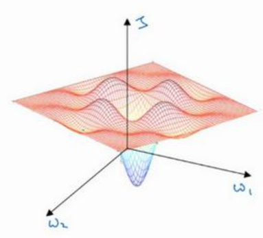
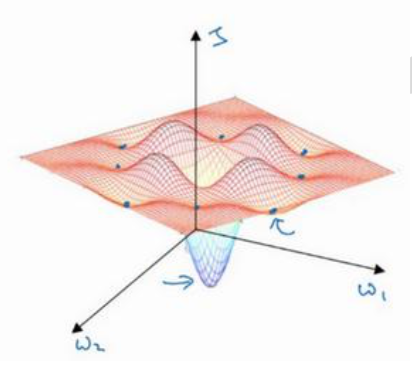
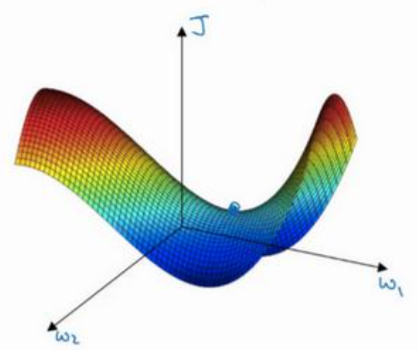
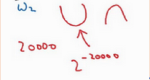
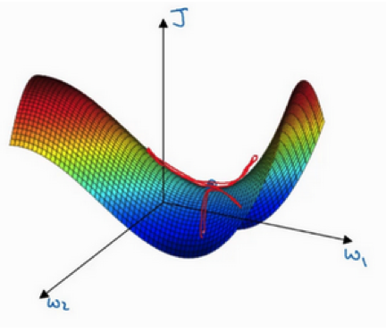
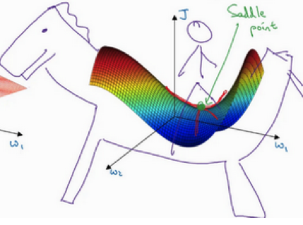

[TOC]

# 第一十三章 优化算法

## 13.1 如何解决训练样本少的问题

目前大部分的深度学习模型仍然需要海量的数据支持。例如 ImageNet 数据就拥有1400多万的图片。而现实生产环境中，数据集通常较小，只有几万甚至几百个样本。这时候，如何在这种情况下应用深度学习呢?  
（1）利用预训练模型进行迁移微调（fine-tuning），预训练模型通常在特征上拥有很好的语义表达。此时，只需将模型在小数据集上进行微调就能取得不错的效果。这也是目前大部分小数据集常用的训练方式。视觉领域内，通常会ImageNet上训练完成的模型。自然语言处理领域，也有BERT模型等预训练模型可以使用。
&emsp;&emsp;
（2）单样本或者少样本学习（one-shot，few-shot learning），这种方式适用于样本类别远远大于样本数量的情况等极端数据集。例如有1000个类别，每个类别只提供1-5个样本。少样本学习同样也需要借助预训练模型，但有别于微调的在于，微调通常仍然在学习不同类别的语义，而少样本学习通常需要学习样本之间的距离度量。例如孪生网络（Siamese Neural Networks）就是通过训练两个同种结构的网络来判别输入的两张图片是否属于同一类。
​	上述两种是常用训练小样本数据集的方式。此外，也有些常用的手段，例如数据集增强、正则或者半监督学习等方式来解决小样本数据集的训练问题。

## 13.2 深度学习是否能胜任所有数据集?

深度学习并不能胜任目前所有的数据环境，以下列举两种情况：

（1）深度学习能取得目前的成果，很大一部分原因依赖于海量的数据集以及高性能密集计算硬件。因此，当数据集过小时，需要考虑与传统机器学习相比，是否在性能和硬件资源效率更具有优势。
（2）深度学习目前在视觉，自然语言处理等领域都有取得不错的成果。这些领域最大的特点就是具有局部相关性。例如图像中，人的耳朵位于两侧，鼻子位于两眼之间，文本中单词组成句子。这些都是具有局部相关性的，一旦被打乱则会破坏语义或者有不同的语义。所以当数据不具备这种相关性的时候，深度学习就很难取得效果。

## 13.3 有没有可能找到比已知算法更好的算法?

在最优化理论发展中，有个没有免费午餐的定律，其主要含义在于，在不考虑具体背景和细节的情况下，任何算法和随机猜的效果期望是一样的。即，没有任何一种算法能优于其他一切算法，甚至不比随机猜好。深度学习作为机器学习领域的一个分支同样符合这个定律。所以，虽然目前深度学习取得了非常不错的成果，但是我们同样不能盲目崇拜。

优化算法本质上是在寻找和探索更符合数据集和问题的算法，这里数据集是算法的驱动力，而需要通过数据集解决的问题就是算法的核心，任何算法脱离了数据都会没有实际价值，任何算法的假设都不能脱离实际问题。因此，实际应用中，面对不同的场景和不同的问题，可以从多个角度针对问题进行分析，寻找更优的算法。

## 13.4 什么是共线性，如何判断和解决共线性问题?

对于回归算法，无论是一般回归还是逻辑回归，在使用多个变量进行预测分析时，都可能存在多变量相关的情况，这就是多重共线性。共线性的存在，使得特征之间存在冗余，导致过拟合。

常用判断是否存在共线性的方法有：

（1）相关性分析。当相关性系数高于0.8，表明存在多重共线性；但相关系数低，并不能表示不存在多重共线性；

（2）方差膨胀因子VIF。当VIF大于5或10时，代表模型存在严重的共线性问题；

（3）条件系数检验。 当条件数大于100、1000时，代表模型存在严重的共线性问题。

通常可通过PCA降维、逐步回归法和LASSO回归等方法消除共线性。

## 13.5 权值初始化方法有哪些？

在深度学习的模型中，从零开始训练时，权重的初始化有时候会对模型训练产生较大的影响。良好的初始化能让模型快速、有效的收敛，而糟糕的初始化会使得模型无法训练。

目前，大部分深度学习框架都提供了各类初始化方式，其中一般常用的会有如下几种：
**1. 常数初始化(constant)** 

​	把权值或者偏置初始化为一个常数。例如设置为0，偏置初始化为0较为常见，权重很少会初始化为0。TensorFlow中也有zeros_initializer、ones_initializer等特殊常数初始化函数。  

**2. 高斯初始化(gaussian)** 

​	 给定一组均值和标准差，随机初始化的参数会满足给定均值和标准差的高斯分布。高斯初始化是很常用的初始化方式。特殊地，在TensorFlow中还有一种截断高斯分布初始化（truncated_normal_initializer），其主要为了将超过两个标准差的随机数重新随机，使得随机数更稳定。

**3. 均匀分布初始化(uniform)** 

​	给定最大最小的上下限，参数会在该范围内以均匀分布方式进行初始化，常用上下限为（0，1）。

**4. xavier 初始化(uniform)**  

​	在batchnorm还未出现之前，要训练较深的网络，防止梯度弥散，需要依赖非常好的初始化方式。xavier 就是一种比较优秀的初始化方式，也是目前最常用的初始化方式之一。其目的是为了使得模型各层的激活值和梯度在传播过程中的方差保持一致。本质上xavier 还是属于均匀分布初始化，但与上述的均匀分布初始化有所不同，xavier 的上下限将在如下范围内进行均匀分布采样：
$$
[-\sqrt{\frac{6}{n+m}},\sqrt{\frac{6}{n+m}}]
$$
​	其中，n为所在层的输入维度，m为所在层的输出维度。

**6. kaiming初始化（msra 初始化）** 

​	kaiming初始化，在caffe中也叫msra 初始化。kaiming初始化和xavier 一样都是为了防止梯度弥散而使用的初始化方式。kaiming初始化的出现是因为xavier存在一个不成立的假设。xavier在推导中假设激活函数都是线性的，而在深度学习中常用的ReLu等都是非线性的激活函数。而kaiming初始化本质上是高斯分布初始化，与上述高斯分布初始化有所不同，其是个满足均值为0，方差为2/n的高斯分布：
$$
[0,\sqrt{\frac{2}{n}}]
$$
​	其中，n为所在层的输入维度。

除上述常见的初始化方式以外，不同深度学习框架下也会有不同的初始化方式，读者可自行查阅官方文档。

## 13.5 如何防止梯度下降陷入局部最优解?

梯度下降法(GD)及其一些变种算法是目前深度学习里最常用于求解凸优化问题的优化算法。神经网络很可能存在很多局部最优解，而非全局最优解。 为了防止陷入局部最优，通常会采用如下一些方法，当然，这并不能保证一定能找到全局最优解，或许能得到一个比目前更优的局部最优解也是不错的：

**（1）stochastic GD** /**Mini-Batch GD** 

​	在GD算法中，每次的梯度都是从所有样本中累计获取的，这种情况最容易导致梯度方向过于稳定一致，且更新次数过少，容易陷入局部最优。而stochastic GD是GD的另一种极端更新方式，其每次都只使用一个样本进行参数更新，这样更新次数大大增加也就不容易陷入局部最优。但引出的一个问题的在于其更新方向过多，导致不易于进一步优化。Mini-Batch GD便是两种极端的折中，即每次更新使用一小批样本进行参数更新。Mini-Batch GD是目前最常用的优化算法，严格意义上Mini-Batch GD也叫做stochastic GD，所以很多深度学习框架上都叫做SGD。
**（2）动量 ** 
​	动量也是GD中常用的方式之一，SGD的更新方式虽然有效，但每次只依赖于当前批样本的梯度方向，这样的梯度方向依然很可能很随机。动量就是用来减少随机，增加稳定性。其思想是模仿物理学的动量方式，每次更新前加入部分上一次的梯度量，这样整个梯度方向就不容易过于随机。一些常见情况时，如上次梯度过大，导致进入局部最小点时，下一次更新能很容易借助上次的大梯度跳出局部最小点。

**（3）自适应学习率 ** 

​	无论是GD还是动量重点优化角度是梯度方向。而学习率则是用来直接控制梯度更新幅度的超参数。自适应学习率的优化方法有很多，例如Adagrad和RMSprop。两种自适应学习率的方式稍有差异，但主要思想都是基于历史的累计梯度去计算一个当前较优的学习率。

## 13.6 常见的损失函数有哪些?

机器学习通过对算法中的目标函数进行不断求解优化，得到最终想要的结果。分类和回归问题中，通常使用损失函数或代价函数作为目标函数。

损失函数用来评价预测值和真实值不一样的程度。通常损失函数越好，模型的性能也越好。

损失函数可分为**经验风险损失**和**结构风险损失**。经验风险损失是根据已知数据得到的损失。结构风险损失是为了防止模型被过度拟合已知数据而加入的惩罚项。

下面介绍常用的损失函数:
**（1）0-1 损失函数**  
&emsp;&emsp;
如果预测值和目标值相等，值为 0，如果不相等，值为 1：
$$
L(Y,f(x))=
\left\{
\begin{array}{}
1\;\;\;,\;\;Y\ne f(x), \\
0\;\;\;,\;\;Y=f(x).
\end{array}
\right.
$$

&emsp;&emsp;
一般的在实际使用中，相等的条件过于严格，可适当放宽条件：
$$
L(Y,f(x))=
\left\{
\begin{array}{}
1\;\;\;,\;\;|Y - f(x)| \ge T, \\
0\;\;\;,\;\;|Y-f(x)| < T.
\end{array}
\right.
$$

&emsp;&emsp;
**（2）绝对值损失函数**  
&emsp;&emsp;
和 0-1 损失函数相似，绝对值损失函数表示为：
$$
L(Y,f(x))=|Y-f(x)|.
$$

&emsp;&emsp;
**（3）平方损失函数**  
$$
L(Y|f(x))=\sum_{N}(Y-f(x))^2.
$$

&emsp;&emsp;
这点可从最小二乘法和欧几里得距离角度理解。最小二乘法的原理是，最优拟合曲线应该 使所有点到回归直线的距离和最小。

&emsp;&emsp;
**（4）log 对数损失函数**  
$$
L(Y,P(Y|X))=-logP(Y|X).
$$

&emsp;&emsp;
常见的逻辑回归使用的就是对数损失函数，有很多人认为逻辑回归的损失函数式平方损失， 其实不然。逻辑回归它假设样本服从伯努利分布，进而求得满足该分布的似然函数，接着取对 数求极值等。逻辑回归推导出的经验风险函数是最小化负的似然函数，从损失函数的角度看， 就是 log 损失函数。

&emsp;&emsp;
**（5）指数损失函数**  
&emsp;&emsp;
指数损失函数的标准形式为：
$$
L(Y|f(x))=exp[-yf(x)].
$$

&emsp;&emsp;
例如 AdaBoost 就是以指数损失函数为损失函数。

&emsp;&emsp;
**（6）Hinge 损失函数**  
&emsp;&emsp;
Hinge 损失函数的标准形式如下：
$$
L(y)=max(0, 1-ty).
$$

&emsp;&emsp;
其中 y 是预测值，范围为(-1,1), t 为目标值，其为-1 或 1。  
&emsp;&emsp;
在线性支持向量机中，最优化问题可等价于：
$$
\underset{w,b}{min}\sum_{i=1}^{N}(1-y_i(wx_i+b))+\lambda \lVert w^2 \rVert
$$

&emsp;&emsp;
$$
\frac{1}{m}\sum_{i=1}^{N}l(wx_i+by_i))+\lVert w^2 \rVert
$$

&emsp;&emsp;
其中$l(wx_i+by_i))$是Hinge损失函数，$\lVert w^2 \rVert$可看做为正则化项。

## 13.7 如何进行特征选择(feature selection)?

### 13.7.1 特征类型有哪些？

对象本身会有许多属性。所谓特征，即能在某方面最能表征对象的一个或者一组属性。一般地，我们可以把特征分为如下三个类型：

（1）相关特征：对于特定的任务和场景具有一定帮助的属性，这些属性通常能有效提升算法性能；

（2）无关特征：在特定的任务和场景下完全无用的属性，这些属性对对象在本目标环境下完全无用；

（3）冗余特征：同样是在特定的任务和场景下具有一定帮助的属性，但这类属性已过多的存在，不具有产生任何新的信息的能力。

### 13.7.2 如何考虑特征选择

当完成数据预处理之后，对特定的场景和目标而言很多维度上的特征都是不具有任何判别或者表征能力的，所以需要对数据在维度上进行筛选。一般地，可以从以下两个方面考虑来选择特征:

（1）特征是否具有发散性：某个特征若在所有样本上的都是一样的或者接近一致，即方差非常小。 也就是说所有样本的都具有一致的表现，那这些就不具有任何信息。

（2）特征与目标的相关性：与目标相关性高的特征，应当优选选择。

### 13.7.3 特征选择方法分类

根据特征选择的形式又可以将特征选择方法分为 3 种:
（1）过滤法：按照发散性或者相关性对各个特征进行评分，设定阈值或者待选择阈值的个数，选择特征。  

（2）包装法：根据目标函数(通常是预测效果评分)，每次选择若干特征，或者排除若干特征。  

（3）嵌入法：先使用某些机器学习的算法和模型进行训练，得到各个特征的权值系数，根据系数从大到小选择特征。

### 13.7.4 特征选择目的

（1）减少特征维度，使模型泛化能力更强，减少过拟合;   

（2）降低任务目标的学习难度；

（3）一组优秀的特征通常能有效的降低模型复杂度，提升模型效率 

## 13.8 梯度消失/梯度爆炸原因，以及解决方法

### 13.8.1 为什么要使用梯度更新规则?

目前深度学习的火热，其最大的功臣之一就是反向传播。反向传播，即根据损失评价函数计算的误差，计算得到梯度，通过梯度反向传播的方式，指导深度网络权值的更新优化。这样做的原因在于，深层网络由许多非线性层堆叠而来，每一层非线性层都可以视为是一个非线性函数，因此整个深度网络可以视为是一个复合的非线性多元函数：
$$
F(x)=f_n(\cdots f_3(f_2(f_1(x)*\theta_1+b)*\theta_2+b)\cdots)
$$
我们最终的目的是希望这个多元函数可以很好的完成输入到输出之间的映射，假设不同的输入，输出的最优解是g(x) ，那么，优化深度网络就是为了寻找到合适的权值，满足 Loss=L(g(x),F(x))取得极小值点，比如最简单的损失函数：
$$
Loss = \lVert g(x)-f(x) \rVert^2_2.

假设损失函数的数据空间是下图这样的，我们最优的权值就是为了寻找下图中的最小值点， 对于这种数学寻找最小值问题，采用梯度下降的方法再适合不过了。

$$

假设损失函数的数据空间是下图这样的，我们最优的权值就是为了寻找下图中的最小值点， 对于这种数学寻找最小值问题，采用梯度下降的方法再适合不过了。

图 13.8.1 

### 13.8.2 梯度消失/爆炸产生的原因?

本质上，梯度消失和爆炸是一种情况。在深层网络中，由于网络过深，如果初始得到的梯度过小，或者传播途中在某一层上过小，则在之后的层上得到的梯度会越来越小，即产生了梯度消失。梯度爆炸也是同样的。一般地，不合理的初始化以及激活函数，如sigmoid等，都会导致梯度过大或者过小，从而引起消失/爆炸。

下面分别从网络深度角度以及激活函数角度进行解释：
（1）网络深度 

若在网络很深时，若权重初始化较小，各层上的相乘得到的数值都会0-1之间的小数，而激活函数梯度也是0-1之间的数。那么连乘后，结果数值就会变得非常小，导致**梯度消失**。若权重初始化较大，大到乘以激活函数的导数都大于1，那么连乘后，可能会导致求导的结果很大，形成**梯度爆炸**。

（2）激活函数  
如果激活函数选择不合适，比如使用 sigmoid，梯度消失就会很明显了，原因看下图，左图是sigmoid的损失函数图，右边是其倒数的图像，如果使用 sigmoid 作为损失函数，其梯度是不可能超过 0.25 的，这样经过链式求导之后，很容易发生梯度消失。

图 13.8.2 sigmod函数与其导数

### 13.8.3 梯度消失、爆炸的解决方案

**1、预训练加微调**  
此方法来自Hinton在2006年发表的一篇论文，Hinton为了解决梯度的问题，提出采取无监督逐层训练方法，其基本思想是每次训练一层隐节点，训练时将上一层隐节点的输出作为输入，而本层隐节点的输出作为下一层隐节点的输入，此过程就是逐层“预训练”（pre-training）；在预训练完成后，再对整个网络进行“微调”（fine-tunning）。Hinton在训练深度信念网络（Deep Belief Networks中，使用了这个方法，在各层预训练完成后，再利用BP算法对整个网络进行训练。此思想相当于是先寻找局部最优，然后整合起来寻找全局最优，此方法有一定的好处，但是目前应用的不是很多了。

**2、梯度剪切、正则**  
梯度剪切这个方案主要是针对梯度爆炸提出的，其思想是设置一个梯度剪切阈值，然后更新梯度的时候，如果梯度超过这个阈值，那么就将其强制限制在这个范围之内。这可以防止梯度爆炸。  
另外一种解决梯度爆炸的手段是采用权重正则化（weithts regularization）比较常见的是L1和L2正则。

**3、ReLu、leakReLu等激活函数**  
（1）ReLu：其函数的导数在正数部分是恒等于1，这样在深层网络中，在激活函数部分就不存在导致梯度过大或者过小的问题，缓解了梯度消失或者爆炸。同时也方便计算。当然，其也存在存在一些缺点，例如过滤到了负数部分，导致部分信息的丢失，输出的数据分布不在以0为中心，改变了数据分布。  
（2）leakrelu：就是为了解决relu的0区间带来的影响，其数学表达为：leakrelu=max(k*x,0)其中k是leak系数，一般选择0.01或者0.02，或者通过学习而来。

**4、batchnorm**  
Batchnorm是深度学习发展以来提出的最重要的成果之一了，目前已经被广泛的应用到了各大网络中，具有加速网络收敛速度，提升训练稳定性的效果，Batchnorm本质上是解决反向传播过程中的梯度问题。Batchnorm全名是Batch Normalization，简称BN，即批规范化，通过规范化操作将输出信号x规范化到均值为0，方差为1保证网络的稳定性。  

**5、残差结构**  
残差的方式，能使得深层的网络梯度通过跳级连接路径直接返回到浅层部分，使得网络无论多深都能将梯度进行有效的回传。

**6、LSTM**  
LSTM全称是长短期记忆网络（long-short term memory networks），是不那么容易发生梯度消失的，主要原因在于LSTM内部复杂的“门”(gates)。在计算时，将过程中的梯度进行了抵消。

## 13.9 深度学习为什么不用二阶优化？

目前深度学习中，反向传播主要是依靠一阶梯度。二阶梯度在理论和实际上都是可以应用都网络中的，但相比于一阶梯度，二阶优化会存在以下一些主要问题：  
（1）计算量大，训练非常慢。   
（2）二阶方法能够更快地求得更高精度的解，这在浅层模型是有益的。而在神经网络这类深层模型中对参数的精度要求不高，甚至不高的精度对模型还有益处，能够提高模型的泛化能力。  
（3）稳定性。二阶方法能更快求高精度的解，同样对数据本身要的精度也会相应的变高，这就会导致稳定性上的问题。

## 13.10 为什么要设置单一数字评估指标，设置指标的意义？

在训练模型时，无论是调整超参数，还是调整不同的模型算法，我们都需要有一个评价指标，这个评价标准能帮助我们很快的了解，新的尝试后模型的性能是否更优。例如在分类时，我们通常会选择选择准确率，当样本不平衡时，查准率和查全率又会是更好的评价指标。所以在训练模型时，如果设置了单一数字的评估指标通常能很快的反应出我们模型的改进是否直接产生了收益，从而加速我们的算法改进过程。若在训练过程中，发现优化目标进一步深入，现有指标无法完全反应进一步的目标时，就需要重新选择评估指标了。

## 13.11训练/验证/测试集的定义及划分

训练、验证、测试集在机器学习领域是非常重要的三个内容。三者共同组成了整个项目的性能的上限和走向。

训练集：用于模型训练的样本集合，样本占用量是最大的；

验证集：用于训练过程中的模型性能评价，跟着性能评价才能更好的调参；

测试集：用于最终模型的一次最终评价，直接反应了模型的性能。

在划分上，可以分两种情况：

1、在样本量有限的情况下，有时候会把验证集和测试集合并。实际中，若划分为三类，那么训练集：验证集：测试集=6:2:2；若是两类，则训练集：验证集=7:3。这里需要主要在数据量不够多的情况，验证集和测试集需要占的数据比例比较多，以充分了解模型的泛化性。

2、在海量样本的情况下，这种情况在目前深度学习中会比较常见。此时由于数据量巨大，我们不需要将过多的数据用于验证和测试集。例如拥有1百万样本时，我们按训练集：验证集：测试集=98:1:1的比例划分，1%的验证和1%的测试集都已经拥有了1万个样本。这已足够验证模型性能了。

此外，三个数据集的划分不是一次就可以的，若调试过程中发现，三者得到的性能评价差异很大时，可以重新划分以确定是数据集划分的问题导致还是由模型本身导致的。其次，若评价指标发生变化，而导致模型性能差异在三者上很大时，同样可重新划分确认排除数据问题，以方便进一步的优化。

## 13.12 什么是可避免偏差？

所以要给这些概念命名一下，这不是广泛使用的术语，但我觉得这么说思考起来比较流畅。就是把这个差值，贝叶斯错误率或者对贝叶斯错误率的估计和训练错误率之间的差值称为可避免偏差，你可能希望一直提高训练集表现，直到你接近贝叶斯错误率，但实际上你也不希望做到比贝叶斯错误率更好，这理论上是不可能超过贝叶斯错误率的，除非过拟合。而这个训练错误率和开发错误率之前的差值，就大概说明你的算法在方差问题上还有多少改善空间。  
可避免偏差这个词说明了有一些别的偏差，或者错误率有个无法超越的最低水平，那就是说如果贝叶斯错误率是7.5%。你实际上并不想得到低于该级别的错误率，所以你不会说你的训练错误率是8%，然后8%就衡量了例子中的偏差大小。你应该说，可避免偏差可能在0.5%左右，或者0.5%是可避免偏差的指标。而这个2%是方差的指标，所以要减少这个2%比减少这个0.5%空间要大得多。而在左边的例子中，这7%衡量了可避免偏差大小，而2\%衡量了方差大小。所以在左边这个例子里，专注减少可避免偏差可能潜力更大。

## 13.13 什么是TOP5错误率？

通常对于分类系统而言，系统会对某个未知样本进行所有已知样本的匹配，并给出该未知样本在每个已知类别上的概率。其中最大的概率就是系统系统判定最可能的一个类别。TOP5则就是在前五个最大概率的类别。TOP5错误率，即预测最可能的五类都不是该样本类别的错误率。  

TOP5错误率通常会用于在类别数量很多或者细粒度类别的模型系统。典型地，例如著名的ImageNet ，其包含了1000个类别。通常就会采用TOP5错误率。

## 13.14 什么是人类水平错误率？

人类水平错误率的定义，就是如果你想要替代或估计贝叶斯错误率，那么一队经验丰富的医生讨论和辩论之后，可以达到0.5%的错误率。我们知道贝叶斯错误率小于等于0.5%，因为有些系统，这些医生团队可以达到0.5%的错误率。所以根据定义，最优错误率必须在0.5%以下。我们不知道多少更好，也许有一个更大的团队，更有经验的医生能做得更好，所以也许比0.5%好一点。但是我们知道最优错误率不能高于0.\%，那么在这个背景下，我就可以用0.5%估计贝叶斯错误率。
现在，为了发表研究论文或者部署系统，也许人类水平错误率的定义可以不一样，你可以使用1%，只要你超越了一个普通医生的表现，如果能达到这种水平，那系统已经达到实用了。也许超过一名放射科医生，一名医生的表现，意味着系统在一些情况下可以有部署价值了。

## 13.15 可避免偏差、几大错误率之间的关系？

要了解为什么这个很重要，我们来看一个错误率分析的例子。比方说，在医学图像诊断例子中，你的训练错误率是5%，你的开发错误率是6%。而在上一张幻灯片的例子中，我们的人类水平表现，我将它看成是贝叶斯错误率的替代品，取决于你是否将它定义成普通单个医生的表现，还是有经验的医生或医生团队的表现，你可能会用1%或0.7%或0.5%。同时也回想一下，前面视频中的定义，贝叶斯错误率或者说贝叶斯错误率的估计和训练错误率直接的差值就衡量了所谓的可避免偏差，这（训练误差与开发误差之间的差值）可以衡量或者估计你的学习算法的方差问题有多严重。  
所以在这个第一个例子中，无论你做出哪些选择，可避免偏差大概是4\%，如果你取1%就是4%，如果你取0.5%就是4.5%，而这个差距（训练误差与开发误差之间的差值）是1%。所以在这个例子中，我得说，不管你怎么定义人类水平错误率，使用单个普通医生的错误率定义，还是单个经验丰富医生的错误率定义或经验丰富的医生团队的错误率定义，这是4%还是4.5%，这明显比都比方差问题更大。所以在这种情况下，你应该专注于减少偏差的技术，例如培训更大的网络。

## 13.16 怎样选取可避免偏差及贝叶斯错误率?

&emsp;&emsp;
就是比如你的训练错误率是0.7%，所以你现在已经做得很好了，你的开发错误率是$0.8\%$。在这种情况下，你用$0.5\%$来估计贝叶斯错误率关系就很大。因为在这种情况下，你测量到的可避免偏差是$0.2\%$，这是你测量到的方差问题$0.1\%$的两倍，这表明也许偏差和方差都存在问题。但是，可避免偏差问题更严重。在这个例子中，我们在上一张幻灯片中讨论的是$0.5\%$，就是对贝叶斯错误率的最佳估计，因为一群人类医生可以实现这一目标。如果你用$0.7$代替贝叶斯错误率，你测得的可避免偏差基本上是$0\%$，那你就可能忽略可避免偏差了。实际上你应该试试能不能在训练集上做得更好。

## 13.17 怎样减少方差？

&emsp;&emsp;
如果你的算法方差较高，可以尝试下面的技巧：  

&emsp;&emsp;
（1）增加训练数据：只要你可以获得大量数据和足够的算力去处理数据，这就是一种解决高方差问题最简单，最可靠的方式。  
&emsp;&emsp;
（2）正则化（L2, L1, dropout）：这种技巧减少方差的同时，增加了偏差。  
&emsp;&emsp;
（3）提前停止（例如，根据开发集的错误率来提前停止梯度下降）：这种技巧减少方差的同时增加的偏差。提前停止技巧很像正则化方法，一些论文作者也叫他正则化技巧。  
&emsp;&emsp;
（4）特征选择来减少输入特征的数量或类型：这种技巧可能会处理好方差问题，但是同时会增大偏差。稍微减少特征数量（比如从1000个特征减少到900个特征）不太可能对偏差产生大的影响。大量减少特征数量（比如从$1000$减少到$100-$减少$10$倍）可能产生较大偏差，因为去掉了很多有用的特征。（注：可能会欠拟合）。在现代的深度学习中，数据量很大，人们对待特征选择的态度出现了转变，现在我们更加倾向于使用全部的特征，让算法自己选择合适的特征。但是当训练集比较小时，特征选择非常有用。  
&emsp;&emsp;
（5）缩小模型（例如减少网络层数和神经元数量）：谨慎使用。这种技巧可以减少方差，同时也可能增加偏差。然而，我并不推荐使用这种技巧来解决方差问题。添加正则化通常会获得更好的分类性能。缩小模型的优点在于减少计算成本，以更快的速度来训练模型。如果模型的训练速度非常重要，那么就想尽一切方法来缩小模型。但是如果目标是减少方差，不是那么在意计算成本，可以考虑添加正则化。

## 13.18 贝叶斯错误率的最佳估计

&emsp;&emsp;
对于这样的问题，更好的估计贝叶斯错误率很有必要，可以帮助你更好地估计可避免偏差和方差，这样你就能更好的做出决策，选择减少偏差的策略，还是减少方差的策略。

## 13.19 举机器学习超过单个人类表现几个例子？

&emsp;&emsp;
现在，机器学习有很多问题已经可以大大超越人类水平了。例如，我想网络广告，估计某个用户点击广告的可能性，可能学习算法做到的水平已经超越任何人类了。还有提出产品建议，向你推荐电影或书籍之类的任务。我想今天的网站做到的水平已经超越你最亲近的朋友了。还有物流预测，从到开车需要多久，或者预测快递车从开到需要多少时间。或者预测某人会不会偿还贷款，这样你就能判断是否批准这人的贷款。我想这些问题都是今天的机器学习远远超过了单个人类的表现。  

&emsp;&emsp;
除了这些问题，今天已经有语音识别系统超越人类水平了，还有一些计算机视觉任务，一些图像识别任务，计算机已经超越了人类水平。但是由于人类对这种自然感知任务非常擅长，我想计算机达到那种水平要难得多。还有一些医疗方面的任务，比如阅读ECG或诊断皮肤癌，或者某些特定领域的放射科读图任务，这些任务计算机做得非常好了，也许超越了单个人类的水平。

## 13.20如何改善你的模型？

&emsp;&emsp;
你们学过正交化，如何设立开发集和测试集，用人类水平错误率来估计贝叶斯错误率以及如何估计可避免偏差和方差。我们现在把它们全部组合起来写成一套指导方针，如何提高学习算法性能的指导方针。  

&emsp;&emsp;
首先，你的算法对训练集的拟合很好，这可以看成是你能做到可避免偏差很低。还有第二件事你可以做好的是，在训练集中做得很好，然后推广到开发集和测试集也很好，这就是说方差不是太大。  
1. 总结一下前几段视频我们见到的步骤，如果你想提升机器学习系统的性能，我建议你们看看训练错误率和贝叶斯错误率估计值之间的距离，让你知道可避免偏差有多大。换句话说，就是你觉得还能做多好，你对训练集的优化还有多少空间。

2. 然后看看你的开发错误率和训练错误率之间的距离，就知道你的方差问题有多大。换句话说，你应该做多少努力让你的算法表现能够从训练集推广到开发集，算法是没有在开发集上训练的。

3. 用尽一切办法减少可避免偏差

4. 比如使用规模更大的模型，这样算法在训练集上的表现会更好，或者训练更久。

5. 使用更好的优化算法，比如说加入momentum或者RMSprop，或者使用更好的算法，比如Adam。你还可以试试寻找更好的新神经网络架构，或者说更好的超参数。这些手段包罗万有，你可以改变激活函数，改变层数或者隐藏单位数，虽然你这么做可能会让模型规模变大。

6. 或者试用其他模型，其他架构，如循环神经网络和卷积神经网络。  

&emsp;&emsp;
在之后的课程里我们会详细介绍的，新的神经网络架构能否更好地拟合你的训练集，有时也很难预先判断，但有时换架构可能会得到好得多的结果。

## 13.21 理解误差分析

&emsp;&emsp;
如果你希望让学习算法能够胜任人类能做的任务，但你的学习算法还没有达到人类的表现，那么人工检查一下你的算法犯的错误也许可以让你了解接下来应该做什么。这个过程称为错误分析，我们从一个例子开始讲吧。  

&emsp;&emsp;
假设你正在调试猫分类器，然后你取得了$90\%$准确率，相当于$10\%$错误，，在你的开发集上做到这样，这离你希望的目标还有很远。也许你的队员看了一下算法分类出错的例子，注意到算法将一些狗分类为猫，你看看这两只狗，它们看起来是有点像猫，至少乍一看是。所以也许你的队友给你一个建议，如何针对狗的图片优化算法。试想一下，你可以针对狗，收集更多的狗图，或者设计一些只处理狗的算法功能之类的，为了让你的猫分类器在狗图上做的更好，让算法不再将狗分类成猫。所以问题在于，你是不是应该去开始做一个项目专门处理狗？这项目可能需要花费几个月的时间才能让算法在狗图片上犯更少的错误，这样做值得吗？或者与其花几个月做这个项目，有可能最后发现这样一点用都没有。这里有个错误分析流程，可以让你很快知道这个方向是否值得努力。  

&emsp;&emsp;
那这个简单的人工统计步骤，错误分析，可以节省大量时间，可以迅速决定什么是最重要的，或者最有希望的方向。实际上，如果你观察$100$个错误标记的开发集样本，也许只需要$5$到$10$分钟的时间，亲自看看这$100$个样本，并亲自统计一下有多少是狗。根据结果，看看有没有占到$5\%$、$50\%$或者其他东西。这个在$5$到$10$分钟之内就能给你估计这个方向有多少价值，并且可以帮助你做出更好的决定，是不是把未来几个月的时间投入到解决错误标记的狗图这个问题。  

&emsp;&emsp;
所以总结一下，进行错误分析，你应该找一组错误样本，可能在你的开发集里或者测试集里，观察错误标记的样本，看看假阳性（false positives）和假阴性（false negatives），统计属于不同错误类型的错误数量。在这个过程中，你可能会得到启发，归纳出新的错误类型，就像我们看到的那样。如果你过了一遍错误样本，然后说，天，有这么多Instagram滤镜或Snapchat滤镜，这些滤镜干扰了我的分类器，你就可以在途中新建一个错误类型。总之，通过统计不同错误标记类型占总数的百分比，可以帮你发现哪些问题需要优先解决，或者给你构思新优化方向的灵感。在做错误分析的时候，有时你会注意到开发集里有些样本被错误标记了，这时应该怎么做呢？我们下一个视频来讨论。

## 13.22 为什么值得花时间查看错误标记数据？

&emsp;&emsp;
最后我讲几个建议：  
&emsp;&emsp;
首先，深度学习研究人员有时会喜欢这样说：“我只是把数据提供给算法，我训练过了，效果拔群”。这话说出了很多深度学习错误的真相，更多时候，我们把数据喂给算法，然后训练它，并减少人工干预，减少使用人类的见解。但我认为，在构造实际系统时，通常需要更多的人工错误分析，更多的人类见解来架构这些系统，尽管深度学习的研究人员不愿意承认这点。  
&emsp;&emsp;
其次，不知道为什么，我看一些工程师和研究人员不愿意亲自去看这些样本，也许做这些事情很无聊，坐下来看100或几百个样本来统计错误数量，但我经常亲自这么做。当我带领一个机器学习团队时，我想知道它所犯的错误，我会亲自去看看这些数据，尝试和一部分错误作斗争。我想就因为花了这几分钟，或者几个小时去亲自统计数据，真的可以帮你找到需要优先处理的任务，我发现花时间亲自检查数据非常值得，所以我强烈建议你们这样做，如果你在搭建你的机器学习系统的话，然后你想确定应该优先尝试哪些想法，或者哪些方向。

## 13.23 快速搭建初始系统的意义？

&emsp;&emsp;
一般来说，对于几乎所有的机器学习程序可能会有$50$个不同的方向可以前进，并且每个方向都是相对合理的可以改善你的系统。但挑战在于，你如何选择一个方向集中精力处理。即使我已经在语音识别领域工作多年了，如果我要为一个新应用程序域构建新系统，我还是觉得很难不花时间去思考这个问题就直接选择方向。所以我建议你们，如果你想搭建全新的机器学习程序，就是快速搭好你的第一个系统，然后开始迭代。我的意思是我建议你快速设立开发集和测试集还有指标，这样就决定了你的目标所在，如果你的目标定错了，之后改也是可以的。但一定要设立某个目标，然后我建议你马上搭好一个机器学习系统原型，然后找到训练集，训练一下，看看效果，开始理解你的算法表现如何，在开发集测试集，你的评估指标上表现如何。当你建立第一个系统后，你就可以马上用到之前说的偏差方差分析，还有之前最后几个视频讨论的错误分析，来确定下一步优先做什么。特别是如果错误分析让你了解到大部分的错误的来源是说话人远离麦克风，这对语音识别构成特殊挑战，那么你就有很好的理由去集中精力研究这些技术，所谓远场语音识别的技术，这基本上就是处理说话人离麦克风很远的情况。

&emsp;&emsp;
建立这个初始系统的所有意义在于，它可以是一个快速和粗糙的实现（quick and dirty implementation），你知道的，别想太多。初始系统的全部意义在于，有一个学习过的系统，有一个训练过的系统，让你确定偏差方差的范围，就可以知道下一步应该优先做什么，让你能够进行错误分析，可以观察一些错误，然后想出所有能走的方向，哪些是实际上最有希望的方向。

## 13.24 为什么要在不同的划分上训练及测试？

&emsp;&emsp;
深度学习算法对训练数据的胃口很大，当你收集到足够多带标签的数据构成训练集时，算法效果最好，这导致很多团队用尽一切办法收集数据，然后把它们堆到训练集里，让训练的数据量更大，即使有些数据，甚至是大部分数据都来自和开发集、测试集不同的分布。在深度学习时代，越来越多的团队都用来自和开发集、测试集分布不同的数据来训练，这里有一些微妙的地方，一些最佳做法来处理训练集和测试集存在差异的情况，我们来看看。

图 13.36 Cat app example

&emsp;&emsp;
假设你在开发一个手机应用，用户会上传他们用手机拍摄的照片，你想识别用户从应用中上传的图片是不是猫。现在你有两个数据来源，一个是你真正关心的数据分布，来自应用上传的数据，比如右边的应用，这些照片一般更业余，取景不太好，有些甚至很模糊，因为它们都是业余用户拍的。另一个数据来源就是你可以用爬虫程序挖掘网页直接下载，就这个样本而言，可以下载很多取景专业、高分辨率、拍摄专业的猫图片。如果你的应用用户数还不多，也许你只收集到$10,000$张用户上传的照片，但通过爬虫挖掘网页，你可以下载到海量猫图，也许你从互联网上下载了超过$20$万张猫图。而你真正关心的算法表现是你的最终系统处理来自应用程序的这个图片分布时效果好不好，因为最后你的用户会上传类似右边这些图片，你的分类器必须在这个任务中表现良好。现在你就陷入困境了，因为你有一个相对小的数据集，只有$10,000$个样本来自那个分布，而你还有一个大得多的数据集来自另一个分布，图片的外观和你真正想要处理的并不一样。但你又不想直接用这$10,000$张图片，因为这样你的训练集就太小了，使用这$20$万张图片似乎有帮助。但是，困境在于，这$20$万张图片并不完全来自你想要的分布，那么你可以怎么做呢？

&emsp;&emsp;
这里有一种选择，你可以做的一件事是将两组数据合并在一起，这样你就有$21$万张照片，你可以把这$21$万张照片随机分配到训练、开发和测试集中。为了说明观点，我们假设你已经确定开发集和测试集各包含$2500$个样本，所以你的训练集有$205000$个样本。现在这么设立你的数据集有一些好处，也有坏处。好处在于，你的训练集、开发集和测试集都来自同一分布，这样更好管理。但坏处在于，这坏处还不小，就是如果你观察开发集，看看这$2500$个样本其中很多图片都来自网页下载的图片，那并不是你真正关心的数据分布，你真正要处理的是来自手机的图片。

&emsp;&emsp;
我建议你走另外一条路，就是这样，训练集，比如说还是$205,000$张图片，我们的训练集是来自网页下载的$200,000$张图片，然后如果需要的话，再加上$5000$张来自手机上传的图片。然后对于开发集和测试集，这数据集的大小是按比例画的，你的开发集和测试集都是手机图。而训练集包含了来自网页的$20$万张图片，还有$5000$张来自应用的图片，开发集就是$2500$张来自应用的图片，测试集也是$2500$张来自应用的图片。这样将数据分成训练集、开发集和测试集的好处在于，现在你瞄准的目标就是你想要处理的目标，你告诉你的团队，我的开发集包含的数据全部来自手机上传，这是你真正关心的图片分布。我们试试搭建一个学习系统，让系统在处理手机上传图片分布时效果良好。缺点在于，当然了，现在你的训练集分布和你的开发集、测试集分布并不一样。但事实证明，这样把数据分成训练、开发和测试集，在长期能给你带来更好的系统性能。我们以后会讨论一些特殊的技巧，可以处理 训练集的分布和开发集和测试集分布不一样的情况。

## 13.25 如何解决数据不匹配问题？

&emsp;&emsp;
如果您的训练集来自和开发测试集不同的分布，如果错误分析显示你有一个数据不匹配的问题该怎么办？这个问题没有完全系统的解决方案，但我们可以看看一些可以尝试的事情。如果我发现有严重的数据不匹配问题，我通常会亲自做错误分析，尝试了解训练集和开发测试集的具体差异。技术上，为了避免对测试集过拟合，要做错误分析，你应该人工去看开发集而不是测试集。

&emsp;&emsp;
但作为一个具体的例子，如果你正在开发一个语音激活的后视镜应用，你可能要看看……我想如果是语音的话，你可能要听一下来自开发集的样本，尝试弄清楚开发集和训练集到底有什么不同。所以，比如说你可能会发现很多开发集样本噪音很多，有很多汽车噪音，这是你的开发集和训练集差异之一。也许你还会发现其他错误，比如在你的车子里的语言激活后视镜，你发现它可能经常识别错误街道号码，因为那里有很多导航请求都有街道地址，所以得到正确的街道号码真的很重要。当你了解开发集误差的性质时，你就知道，开发集有可能跟训练集不同或者更难识别，那么你可以尝试把训练数据变得更像开发集一点，或者，你也可以收集更多类似你的开发集和测试集的数据。所以，比如说，如果你发现车辆背景噪音是主要的错误来源，那么你可以模拟车辆噪声数据，我会在下一张幻灯片里详细讨论这个问题。或者你发现很难识别街道号码，也许你可以有意识地收集更多人们说数字的音频数据，加到你的训练集里。

&emsp;&emsp;
现在我知道这张幻灯片只给出了粗略的指南，列出一些你可以做的尝试，这不是一个系统化的过程，我想，这不能保证你一定能取得进展。但我发现这种人工见解，我们可以一起尝试收集更多和真正重要的场合相似的数据，这通常有助于解决很多问题。所以，如果你的目标是让训练数据更接近你的开发集，那么你可以怎么做呢？

&emsp;&emsp;
你可以利用的其中一种技术是人工合成数据（artificial data synthesis），我们讨论一下。在解决汽车噪音问题的场合，所以要建立语音识别系统。也许实际上你没那么多实际在汽车背景噪音下录得的音频，或者在高速公路背景噪音下录得的音频。但我们发现，你可以合成。所以假设你录制了大量清晰的音频，不带车辆背景噪音的音频，“The quick brown fox jumps over the lazy dog”（音频播放），所以，这可能是你的训练集里的一段音频，顺便说一下，这个句子在AI测试中经常使用，因为这个短句包含了从a到z所有字母，所以你会经常见到这个句子。但是，有了这个“the quick brown fox jumps over the lazy dog”这段录音之后，你也可以收集一段这样的汽车噪音，（播放汽车噪音音频）这就是汽车内部的背景噪音，如果你一言不发开车的话，就是这种声音。如果你把两个音频片段放到一起，你就可以合成出"the quick brown fox jumps over the lazy dog"（带有汽车噪声），在汽车背景噪音中的效果，听起来像这样，所以这是一个相对简单的音频合成例子。在实践中，你可能会合成其他音频效果，比如混响，就是声音从汽车内壁上反弹叠加的效果。

&emsp;&emsp;
但是通过人工数据合成，你可以快速制造更多的训练数据，就像真的在车里录的那样，那就不需要花时间实际出去收集数据，比如说在实际行驶中的车子，录下上万小时的音频。所以，如果错误分析显示你应该尝试让你的数据听起来更像在车里录的，那么人工合成那种音频，然后喂给你的机器学习算法，这样做是合理的。

&emsp;&emsp;
现在我们要提醒一下，人工数据合成有一个潜在问题，比如说，你在安静的背景里录得$10,000$小时音频数据，然后，比如说，你只录了一小时车辆背景噪音，那么，你可以这么做，将这$1$小时汽车噪音回放$10,000$次，并叠加到在安静的背景下录得的$10,000$小时数据。如果你这么做了，人听起来这个音频没什么问题。但是有一个风险，有可能你的学习算法对这1小时汽车噪音过拟合。特别是，如果这组汽车里录的音频可能是你可以想象的所有汽车噪音背景的集合，如果你只录了一小时汽车噪音，那你可能只模拟了全部数据空间的一小部分，你可能只从汽车噪音的很小的子集来合成数据。

&emsp;&emsp;
所以，总而言之，如果你认为存在数据不匹配问题，我建议你做错误分析，或者看看训练集，或者看看开发集，试图找出，试图了解这两个数据分布到底有什么不同，然后看看是否有办法收集更多看起来像开发集的数据作训练。

&emsp;&emsp;
我们谈到其中一种办法是人工数据合成，人工数据合成确实有效。在语音识别中。我已经看到人工数据合成显著提升了已经非常好的语音识别系统的表现，所以这是可行的。但当你使用人工数据合成时，一定要谨慎，要记住你有可能从所有可能性的空间只选了很小一部分去模拟数据。

&emsp;&emsp;
所以这就是如何处理数据不匹配问题，接下来，我想和你分享一些想法就是如何从多种类型的数据同时学习。

## 13.26 梯度检验注意事项？

&emsp;&emsp;
首先，不要在训练中使用梯度检验，它只用于调试。我的意思是，计算所有值的是一个非常漫长的计算过程，为了实施梯度下降，你必须使用和 backprop来计算，并使用backprop来计算导数，只要调试的时候，你才会计算它，来确认数值是否接近。完成后，你会关闭梯度检验，梯度检验的每一个迭代过程都不执行它，因为它太慢了。

&emsp;&emsp;
第二点，如果算法的梯度检验失败，要检查所有项，检查每一项，并试着找出bug，也就是说，如果与$d\theta[i]$的值相差很大，我们要做的就是查找不同的$i$值，看看是哪个导致与的值相差这么多。举个例子，如果你发现，相对某些层或某层的或的值相差很大，但是的各项非常接近，注意的各项与和的各项都是一一对应的，这时，你可能会发现，在计算参数的导数的过程中存在bug。反过来也是一样，如果你发现它们的值相差很大，的值与的值相差很大，你会发现所有这些项目都来自于或某层的，可能帮你定位bug的位置，虽然未必能够帮你准确定位bug的位置，但它可以帮助你估测需要在哪些地方追踪bug。

&emsp;&emsp;
第三点，在实施梯度检验时，如果使用正则化，请注意正则项。如果代价函数，这就是代价函数J的定义，等于与相关的函数的梯度，包括这个正则项，记住一定要包括这个正则项。

&emsp;&emsp;
第四点，梯度检验不能与dropout同时使用，因为每次迭代过程中，dropout会随机消除隐藏层单元的不同子集，难以计算dropout在梯度下降上的代价函数J。因此dropout可作为优化代价函数的一种方法，但是代价函数J被定义为对所有指数极大的节点子集求和。而在任何迭代过程中，这些节点都有可能被消除，所以很难计算代价函数。你只是对成本函数做抽样，用dropout，每次随机消除不同的子集，所以很难用梯度检验来双重检验dropout的计算，所以我一般不同时使用梯度检验和dropout。如果你想这样做，可以把dropout中的keepprob设置为$1.0$，然后打开dropout，并寄希望于dropout的实施是正确的，你还可以做点别的，比如修改节点丢失模式确定梯度检验是正确的。实际上，我一般不这么做，我建议关闭dropout，用梯度检验进行双重检查，在没有dropout的情况下，你的算法至少是正确的，然后打开dropout。

&emsp;&emsp;
最后一点，也是比较微妙的一点，现实中几乎不会出现这种情况。当和接近0时，梯度下降的实施是正确的，在随机初始化过程中$……$，但是在运行梯度下降时，和变得更大。可能只有在和接近$0$时，backprop的实施才是正确的。但是当和变大时，它会变得越来越不准确。你需要做一件事，我不经常这么做，就是在随机初始化过程中，运行梯度检验，然后再训练网络，和会有一段时间远离$0$，如果随机初始化值比较小，反复训练网络之后，再重新运行梯度检验。

&emsp;&emsp;
这就是梯度检验，恭喜大家，这是本周最后一课了。回顾这一周，我们讲了如何配置训练集，验证集和测试集，如何分析偏差和方差，如何处理高偏差或高方差以及高偏差和高方差并存的问题，如何在神经网络中应用不同形式的正则化，如正则化和dropout，还有加快神经网络训练速度的技巧，最后是梯度检验。这一周我们学习了很多内容，你可以在本周编程作业中多多练习这些概念。祝你好运，期待下周再见。

## 13.27什么是随机梯度下降？

&emsp;&emsp;
随机梯度下降，简称SGD，是指梯度下降算法在训练集上，对每一个训练数据都计算误差并更新模型。
对每一个数据都进行模型更新意味着随机梯度下降是一种[在线机器学习算法](https://en.wikipedia.org/wiki/Online_machine_learning)。  

&emsp;&emsp;
优点:
* 频繁的更新可以给我们一个模型表现和效率提升的即时反馈。
* 这可能是最容易理解和实现的一种方式，尤其对于初学者。
* 较高的模型更新频率在一些问题上可以快速的学习。
* 这种伴有噪声的更新方式能让模型避免局部最优（比如过早收敛）。

&emsp;&emsp;
缺点:
* 这种方式相比其他来说，计算消耗更大，在大数据集上花费的训练时间更多。
* 频繁的更新产生的噪声可能导致模型参数和模型误差来回跳动（更大的方差）。
* 这种伴有噪声的更新方式也能让算法难以稳定的收敛于一点。

## 13.28什么是批量梯度下降？

&emsp;&emsp;
批量梯度下降对训练集上每一个数据都计算误差，但只在所有训练数据计算完成后才更新模型。  
&emsp;&emsp;
对训练集上的一次训练过程称为一代（epoch）。因此，批量梯度下降是在每一个训练epoch之后更新模型。  

&emsp;&emsp;
优点：
* 更少的模型更新意味着比SGD有更高的计算效率。
* 在一些问题上可以得到更稳定的误差梯度和更稳定的收敛点。
* 误差计算和模型更新过程的分离有利于并行算法的实现。

&emsp;&emsp;
缺点：
* 更稳定的误差梯度可能导致模型过早收敛于一个不是最优解的参数集。
* 每一次epoch之后才更新会增加一个累加所有训练数据误差的复杂计算。
* 通常来说，批量梯度下降算法需要把所有的训练数据都存放在内存中。
* 在大数据集上，训练速度会非常慢。

## 13.29什么是小批量梯度下降？

&emsp;&emsp;
小批量梯度下降把训练集划分为很多批，对每一批（batch）计算误差并更新参数。  
&emsp;&emsp;
可以选择对batch的梯度进行累加，或者取平均值。取平均值可以减少梯度的方差。  
&emsp;&emsp;
小批量梯度下降在随机梯度下降的鲁棒性和批量梯度下降的效率之间取得平衡。是如今深度学习领域最常见的实现方式。  

&emsp;&emsp;
优点：
* 比批量梯度下降更快的更新频率有利于更鲁棒的收敛，避免局部最优。
* 相比随机梯度下降更具计算效率。
* 不需要把所有数据放入内存中。

&emsp;&emsp;
缺点：
* 小批量梯度下降给算法增加了一个超参数batch size。
* 和批量梯度下降一样，每一个batch上的误差需要累加。

## 13.30怎么配置mini-batch梯度下降

&emsp;&emsp;
Mini-batch梯度下降对于深度学习大部分应用是最常用的方法。  
&emsp;&emsp;
Mini-batch sizes，简称为 “batch sizes”，是算法设计中需要调节的参数。比如对应于不同GPU或CPU硬件$(32,64,128,256,\cdots)$的内存要求。  
&emsp;&emsp;
batch size是学习过程中的“滑块”。  

&emsp;&emsp;
（1）较小的值让学习过程收敛更快，但是产生更多噪声。  
&emsp;&emsp;
（2）较大的值让学习过程收敛较慢，但是准确的估计误差梯度。

&emsp;&emsp;
**建议1：batch size的默认值最好是$32$**  
&emsp;&emsp;
batch size通常从1到几百之间选择，比如$32$是一个很好的默认值，超过$10$的值可以充分利用矩阵$*$矩阵相对于矩阵$*$向量的加速优势。
[——Practical recommendations for gradient-based training of deep architectures, 2012](https://arxiv.org/abs/1206.5533)

&emsp;&emsp;
**建议2：调节batch size时，最好观察模型在不同batch size下的训练时间和验证误差的学习曲线**  
&emsp;&emsp;
相比于其他超参数，它可以被单独优化。在其他超参数（除了学习率）确定之后，在对比训练曲线（训练误差和验证误差对应于训练时间）。 

&emsp;&emsp;
**建议3：调整其他所有超参数之后再调整batch size和学习率**
&emsp;&emsp;
batch size和学习率几乎不受其他超参数的影响，因此可以放到最后再优化。batch size确定之后，可以被视为固定值，从而去优化其他超参数（如果使用了动量超参数则例外）。

## 13.31 局部最优的问题

&emsp;&emsp;
在深度学习研究早期，人们总是担心优化算法会困在极差的局部最优，不过随着深度学习理论不断发展，我们对局部最优的理解也发生了改变。我向你展示一下现在我们怎么看待局部最优以及深度学习中的优化问题。

图 13.43.1 

&emsp;&emsp;
这是曾经人们在想到局部最优时脑海里会出现的图，也许你想优化一些参数，我们把它们称之为和，平面的高度
就是损失函数。在图中似乎各处都分布着局部最优。梯度下降法或者某个算法可能困在一个局部最优中，而不会抵达
全局最优。如果你要作图计算一个数字，比如说这两个维度，就容易出现有多个不同局部最优的图，而这些低维的图
曾经影响了我们的理解，但是这些理解并不正确。事实上，如果你要创建一个神经网络，通常梯度为零的点并不是这
个图中的局部最优点，实际上成本函数的零梯度点，通常是鞍点。

图 13.43.2 

&emsp;&emsp;
也就是在这个点，这里是和，高度即成本函数的值。

图 13.43.3 

&emsp;&emsp;
但是一个具有高维度空间的函数，如果梯度为$0$，那么在每个方向，它可能是凸函数，也可能是凹函数。如果你在$2$万维空间中，那么想要得到局部最优，所有的$2$万个方向都需要是这样，但发生的机率也许很小，也许是，你更有可能遇到有些方向的曲线会这样向上弯曲，另一些方向曲线向下弯，而不是所有的都向上弯曲，因此在高维度空间，你更可能碰到鞍点。

图 13.43.4 

&emsp;&emsp;
就像下面的这种：

图 13.43.5 

&emsp;&emsp;
而不会碰到局部最优。至于为什么会把一个曲面叫做鞍点，你想象一下，就像是放在马背上的马鞍一样，如果这是马，这是马的头，这就是马的眼睛，画得不好请多包涵，然后你就是骑马的人，要坐在马鞍上，因此这里的这个点，导数为$0$的点，这个点叫做鞍点。我想那确实是你坐在马鞍上的那个点，而这里导数为$0$。

图 13.43.6 

&emsp;&emsp;
所以我们从深度学习历史中学到的一课就是，我们对低维度空间的大部分直觉，比如你可以画出上面的图，并不能应用到高维度空间中。适用于其它算法，因为如果你有$2$万个参数，那么函数有$2$万个维度向量，你更可能遇到鞍点，而不是局部最优点。

&emsp;&emsp;
如果局部最优不是问题，那么问题是什么？结果是平稳段会减缓学习，平稳段是一块区域，其中导数长时间接近于$0$，如果你在此处，梯度会从曲面从从上向下下降，因为梯度等于或接近$0$，曲面很平坦，你得花上很长时间慢慢抵达平稳段的这个点，因为左边或右边的随机扰动，我换个笔墨颜色，大家看得清楚一些，然后你的算法能够走出平稳段（红色笔）。

图 13.43.7 

&emsp;&emsp;
我们可以沿着这段长坡走，直到这里，然后走出平稳段。

图 13.43.8 

&emsp;&emsp;
所以此次视频的要点是，首先，你不太可能困在极差的局部最优中，条件是你在训练较大的神经网络，存在大量参数，并且成本函数被定义在较高的维度空间。

&emsp;&emsp;
第二点，平稳段是一个问题，这样使得学习十分缓慢，这也是像Momentum或是RMSprop，Adam这样的算法，能够加速学习算法的地方。在这些情况下，更成熟的优化算法，如Adam算法，能够加快速度，让你尽早往下走出平稳段。

&emsp;&emsp;
因为你的网络要解决优化问题，说实话，要面临如此之高的维度空间，我觉得没有人有那么好的直觉，知道这些空间长什么样，而且我们对它们的理解还在不断发展，不过我希望这一点能够让你更好地理解优化算法所面临的问题。

## 13.32 提升算法性能思路

&emsp;&emsp;
这个列表里提到的思路并完全，但是一个好的开始。  
&emsp;&emsp;
我的目的是给出很多可以尝试的思路，希望其中的一或两个你之前没有想到。你经常只需要一个好的想法就能得到性能提升。  
&emsp;&emsp;
如果你能从其中一个思路中得到结果，请在评论区告诉我。我很高兴能得知这些好消息。  
&emsp;&emsp;
如果你有更多的想法，或者是所列思路的拓展，也请告诉我，我和其他读者都将受益！有时候仅仅是一个想法或许就能使他人得到突破。

1. 通过数据提升性能 
2. 通过算法提升性能 
3. 通过算法调参提升性能 
4. 通过嵌套模型提升性能

&emsp;&emsp;
通常来讲，随着列表自上而下，性能的提升也将变小。例如，对问题进行新的架构或者获取更多的数据，通常比调整最优算法的参数能带来更好的效果。虽然并不总是这样，但是通常来讲是的。

&emsp;&emsp;
我已经把相应的链接加入了博客的教程中，相应网站的问题中，以及经典的Neural Net FAQ中。  
&emsp;&emsp;
部分思路只适用于人工神经网络，但是大部分是通用的。通用到足够你用来配合其他技术来碰撞出提升模型性能的方法。
OK，现在让我们开始吧。

1. 通过数据提升性能 

&emsp;&emsp;
对你的训练数据和问题定义进行适当改变，你能得到很大的性能提升。或许是最大的性能提升。  

&emsp;&emsp;
以下是我将要提到的思路：  
&emsp;&emsp;
获取更多数据、创造更多数据、重放缩你的数据、转换你的数据、特征选取、重架构你的问题

&emsp;&emsp;
1）获取更多数据  
&emsp;&emsp;
你能获取更多训练数据吗？   
&emsp;&emsp;
你的模型的质量通常受到你的训练数据质量的限制。为了得到最好的模型，你首先应该想办法获得最好的数据。你也想尽可能多的获得那些最好的数据。  
&emsp;&emsp;
有更多的数据，深度学习和其他现代的非线性机器学习技术有更全的学习源，能学得更好，深度学习尤为如此。这也是机器学习对大家充满吸引力的很大一个原因（世界到处都是数据）。  

&emsp;&emsp;
2） 创造更多数据  
&emsp;&emsp;
上一小节说到了有了更多数据，深度学习算法通常会变的更好。有些时候你可能无法合理地获取更多数据，那你可以试试创造更多数据。  
&emsp;&emsp;
如果你的数据是数值型向量，可以随机构造已有向量的修改版本。  
&emsp;&emsp;
如果你的数据是图片，可以随机构造已有图片的修改版本(平移、截取、旋转等)。  
&emsp;&emsp;
如果你的数据是文本，类似的操作……  
&emsp;&emsp;
这通常被称作数据扩增（data augmentation）或者数据生成（data generation）。  
&emsp;&emsp;
你可以利用一个生成模型。你也可以用一些简单的技巧。例如，针对图片数据，你可以通过随机地平移或旋转已有图片获取性能的提升。如果新数据中包含了这种转换，则提升了模型的泛化能力。  
&emsp;&emsp;
这也与增加噪声是相关的，我们习惯称之为增加扰动。它起到了与正则化方法类似的作用，即抑制训练数据的过拟合。

&emsp;&emsp;
3）重缩放(rescale)你的数据  
&emsp;&emsp;
这是一个快速获得性能提升的方法。 当应用神经网络时，一个传统的经验法则是：重缩放(rescale)你的数据至激活函数的边界。  
&emsp;&emsp;
如果你在使用sigmoid激活函数，重缩放你的数据到0和1的区间里。如果你在使用双曲正切（tanh）激活函数，重缩放数据到－1和1的区间里。  
&emsp;&emsp;
这种方法可以被应用到输入数据（x）和输出数据（y）。例如，如果你在输出层使用sigmoid函数去预测二元分类的结果，应当标准化y值，使之成为二元的。如果你在使用softmax函数，你依旧可以通过标准化y值来获益。  
&emsp;&emsp;
这依旧是一个好的经验法则，但是我想更深入一点。我建议你可以参考下述方法来创造一些训练数据的不同的版本：  
&emsp;&emsp;
归一化到0和1的区间。  
&emsp;&emsp;
重放缩到－1和1的区间  
&emsp;&emsp;
标准化（译者注：标准化数据使之成为零均值，单位标准差）  
&emsp;&emsp;
然后对每一种方法，评估你的模型的性能，选取最好的进行使用。如果你改变了你的激活函数，重复这一过程。  
&emsp;&emsp;
在神经网络中，大的数值累积效应(叠加叠乘)并不是好事，除上述方法之外，还有其他的方法来控制你的神经网络中数据的数值大小，譬如归一化激活函数和权重，我们会在以后讨论这些技术。  

&emsp;&emsp;
4）数据变换  
&emsp;&emsp;
这里的数据变换与上述的重缩放方法类似，但需要更多工作。你必须非常熟悉你的数据。通过可视化来考察离群点。  
&emsp;&emsp;
猜测每一列数据的单变量分布。  
&emsp;&emsp;
列数据看起来像偏斜的高斯分布吗？考虑用Box-Cox变换调整偏态。  
&emsp;&emsp;
列数据看起来像指数分布吗？考虑用对数变换。  
&emsp;&emsp;
列数据看起来有一些特征，但是它们被一些明显的东西遮盖了，尝试取平方或者开平方根来转换数据  
&emsp;&emsp;
你能离散化一个特征或者以某种方式组合特征，来更好地突出一些特征吗？  
&emsp;&emsp;
依靠你的直觉，尝试以下方法。  
&emsp;&emsp;
你能利用类似PCA的投影方法来预处理数据吗？  
&emsp;&emsp;
你能综合多维特征至一个单一数值(特征)吗？  
&emsp;&emsp;
你能用一个新的布尔标签去发现问题中存在一些有趣的方面吗？  
&emsp;&emsp;
你能用其他方法探索出目前场景下的其他特殊结构吗？  
&emsp;&emsp;
神经网层擅长特征学习(feature engineering)。它(自己)可以做到这件事。但是如果你能更好的发现问题到网络中的结构，神经网层会学习地更快。你可以对你的数据就不同的转换方式进行抽样调查，或者尝试特定的性质，来看哪些有用，哪些没用。  

&emsp;&emsp;
5）特征选择  
&emsp;&emsp;
一般说来，神经网络对不相关的特征是具有鲁棒的(校对注：即不相关的特征不会很大影响神经网络的训练和效果)。它们会用近似于0的权重来弱化那些没有预测能力的特征的贡献。

&emsp;&emsp;
尽管如此，这些无关的数据特征，在训练周期依旧要耗费大量的资源。所以你能去除数据里的一些特征吗？  
&emsp;&emsp;
有许多特征选择的方法和特征重要性的方法，这些方法能够给你提供思路，哪些特征该保留，哪些特征该剔除。最简单的方式就是对比所有特征和部分特征的效果。同样的，如果你有时间，我建议在同一个网络中尝试选择不同的视角来看待你的问题，评估它们，来看看分别有怎样的性能。  
&emsp;&emsp;
或许你利用更少的特征就能达到同等甚至更好的性能。而且，这将使模型变得更快！  
&emsp;&emsp;
或许所有的特征选择方法都剔除了同样的特征子集。很好，这些方法在没用的特征上达成了一致。  
&emsp;&emsp;
或许筛选过后的特征子集，能带给特征工程的新思路。  
&emsp;&emsp;

&emsp;&emsp;
6）重新架构你的问题  
&emsp;&emsp;
有时候要试试从你当前定义的问题中跳出来，想想你所收集到的观察值是定义你问题的唯一方式吗？或许存在其他方法。或许其他构建问题的方式能够更好地揭示待学习问题的结构。  
&emsp;&emsp;
我真的很喜欢这个尝试，因为它迫使你打开自己的思路。这确实很难，尤其是当你已经对当前的方法投入了大量的时间和金钱时。  
&emsp;&emsp;
但是咱们这么想想，即使你列出了3-5个可供替代的建构方案，而且最终还是放弃了它们，但这至少说明你对当前的方案更加自信了。   
&emsp;&emsp;
看看能够在一个时间窗（时间周期）内对已有的特征/数据做一个合并。  
&emsp;&emsp;
或许你的分类问题可以成为一个回归问题(有时候是回归到分类)。  
&emsp;&emsp;
或许你的二元输出可以变成softmax输出？  
&emsp;&emsp;
或许你可以转而对子问题进行建模。  
&emsp;&emsp;
仔细思考你的问题，最好在你选定工具之前就考虑用不同方法构建你的问题，因为此时你对解决方案并没有花费太多的投入。除此之外，如果你在某个问题上卡住了，这样一个简单的尝试能释放更多新的想法。  

2. 通过算法提升性能  

&emsp;&emsp;
机器学习当然是用算法解决问题。  
&emsp;&emsp;
所有的理论和数学都是描绘了应用不同的方法从数据中学习一个决策过程（如果我们这里只讨论预测模型）。  
&emsp;&emsp;
你已经选择了深度学习来解释你的问题。但是这真的是最好的选择吗？在这一节中，我们会在深入到如何最大地发掘你所选择的深度学习方法之前，接触一些算法选择上的思路。  

下面是一个简要列表：
* 对算法进行抽样调查
* 借鉴已有文献
* 重采样方法

下面我解释下上面提到的几个方法:

&emsp;&emsp;
1）对算法进行抽样调查  
&emsp;&emsp;
其实你事先无法知道，针对你的问题哪个算法是最优的。如果你知道，你可能就不需要机器学习了。那有没有什么数据(办法)可以证明你选择的方法是正确的？  

&emsp;&emsp;
让我们来解决这个难题。当从所有可能的问题中平均来看各算法的性能时，没有哪个算法能够永远胜过其他算法。所有的算法都是平等的，下面是在no free lunch theorem中的一个总结。 

&emsp;&emsp;
或许你选择的算法不是针对你的问题最优的那个   
&emsp;&emsp;
我们不是在尝试解决所有问题，算法世界中有很多新热的方法，可是它们可能并不是针对你数据集的最优算法。  
&emsp;&emsp;
我的建议是收集(证据)数据指标。接受更好的算法或许存在这一观点，并且给予其他算法在解决你的问题上“公平竞争”的机会。  
&emsp;&emsp;
抽样调查一系列可行的方法，来看看哪些还不错，哪些不理想。  
&emsp;&emsp;
首先尝试评估一些线性方法，例如逻辑回归（logistic regression）和线性判别分析（linear discriminate analysis）。  
&emsp;&emsp;
评估一些树类模型，例如CART， 随机森林（Random Forest）和Gradient Boosting。  
&emsp;&emsp;
评估一些实例方法，例如支持向量机（SVM）和K-近邻（kNN）。  
&emsp;&emsp;
评估一些其他的神经网络方法，例如LVQ, MLP, CNN, LSTM, hybrids等  

&emsp;&emsp;
选取性能最好的算法，然后通过进一步的调参和数据准备来提升。尤其注意对比一下深度学习和其他常规机器学习方法，对上述结果进行排名，比较他们的优劣。

&emsp;&emsp;
很多时候你会发现在你的问题上可以不用深度学习，而是使用一些更简单，训练速度更快，甚至是更容易理解的算法。

&emsp;&emsp;
2）借鉴已有文献  
&emsp;&emsp;
方法选择的一个捷径是借鉴已有的文献资料。可能有人已经研究过与你的问题相关的问题，你可以看看他们用的什么方法。  
&emsp;&emsp;
你可以阅读论文，书籍，博客，问答网站，教程，以及任何能在谷歌搜索到的东西。  
&emsp;&emsp;
写下所有的想法，然后用你的方式把他们研究一遍。   
&emsp;&emsp;
这不是复制别人的研究，而是启发你想出新的想法，一些你从没想到但是却有可能带来性能提升的想法。  
&emsp;&emsp;
发表的研究通常都是非常赞的。世界上有非常多聪明的人，写了很多有趣的东西。你应当好好挖掘这个“图书馆”，找到你想要的东西。  

&emsp;&emsp;
3）重采样方法  
&emsp;&emsp;
你必须知道你的模型效果如何。你对模型性能的估计可靠吗？  
&emsp;&emsp;
深度学习模型在训练阶段非常缓慢。这通常意味着，我们无法用一些常用的方法，例如k层交叉验证，去估计模型的性能。

&emsp;&emsp;
或许你在使用一个简单的训练集／测试集分割，这是常规套路。如果是这样，你需要确保这种分割针对你的问题具有代表性。单变量统计和可视化是一个好的开始。

&emsp;&emsp;
或许你能利用硬件来加速估计的过程。例如，如果你有集群或者AWS云端服务（Amazon Web Services）账号，你可以并行地训练n个模型，然后获取结果的均值和标准差来得到更鲁棒的估计。

&emsp;&emsp;
或许你可以利用hold-out验证方法来了解模型在训练后的性能（这在早停法（early stopping）中很有用，后面会讲到）。

&emsp;&emsp;
或许你可以先隐藏一个完全没用过的验证集，等到你已经完成模型选择之后再使用它。  
&emsp;&emsp;
而有时候另外的方式，或许你能够让数据集变得更小，以及使用更强的重采样方法。  
&emsp;&emsp;
有些情况下你会发现在训练集的一部分样本上训练得到的模型的性能，和在整个数据集上训练得到的模型的性能有很强的相关性。也许你可以先在小数据集上完成模型选择和参数调优，然后再将最终的方法扩展到全部数据集上。

&emsp;&emsp;
或许你可以用某些方式限制数据集，只取一部分样本，然后用它进行全部的建模过程。

3. 通过算法调参提升性能

&emsp;&emsp;
这通常是工作的关键所在。你经常可以通过抽样调查快速地发现一个或两个性能优秀的算法。但是如果想得到最优的算法可能需要几天，几周，甚至几个月。

为了获得更优的模型，以下是对神经网络算法进行参数调优的几点思路：  

* 诊断（Diagnostics）  
* 权重初始化（Weight Initialization）  
* 学习速率（Learning Rate）  
* 激活函数  
* 网络拓扑（Network Topology）  
* 批次和周期（Batches and Epochs）  
* 正则化  
* 优化和损失  
* 早停法

&emsp;&emsp;
你可能需要训练一个给定“参数配置”的神经网络模型很多次（3-10次甚至更多），才能得到一个估计性能不错的参数配置。这一点几乎适用于这一节中你能够调参的所有方面。

&emsp;&emsp;
1）诊断  
&emsp;&emsp;
如果你能知道为什么你的模型性能不再提高了，你就能获得拥有更好性能的模型。   
&emsp;&emsp;
你的模型是过拟合还是欠拟合？永远牢记这个问题。永远。   
&emsp;&emsp;
模型总是会遇到过拟合或者欠拟合，只是程度不同罢了。一个快速了解模型学习行为的方法是，在每个周期，评估模型在训练集和验证集上的表现，并作出图表。

&emsp;&emsp;
如果训练集上的模型总是优于验证集上的模型，你可能遇到了过拟合，你可以使用诸如正则化的方法。

&emsp;&emsp;
如果训练集和验证集上的模型都很差，你可能遇到了欠拟合，你可以提升网络的容量，以及训练更多或者更久。

&emsp;&emsp;
如果有一个拐点存在，在那之后训练集上的模型开始优于验证集上的模型，你可能需要使用早停法。  
&emsp;&emsp;
经常画一画这些图表，学习它们来了解不同的方法，你能够提升模型的性能。这些图表可能是你能创造的最有价值的（模型状态）诊断信息。  
&emsp;&emsp;
另一个有用的诊断是网络模型判定对和判定错的观察值。  
&emsp;&emsp;
对于难以训练的样本，或许你需要更多的数据。  
&emsp;&emsp;
或许你应该剔除训练集中易于建模的多余的样本。  
&emsp;&emsp;
也许可以尝试对训练集划分不同的区域，在特定区域中用更专长的模型。

&emsp;&emsp;
2）权重初始化  
&emsp;&emsp;
经验法则通常是：用小的随机数进行初始化。  
&emsp;&emsp;
在实践中，这可能依旧效果不错，但是对于你的网络来说是最佳的吗？对于不同的激活函数也有一些启发式的初始化方法，但是在实践应用中并没有太多不同。  
&emsp;&emsp;
固定你的网络，然后尝试多种初始化方式。  
&emsp;&emsp;
记住，权重是你的模型真正的参数，你需要找到他们。有很多组权重都能有不错的性能表现，但我们要尽量找到最好的。  

&emsp;&emsp;
尝试所有不同的初始化方法，考察是否有一种方法在其他情况不变的情况下(效果)更优。

&emsp;&emsp;
尝试用无监督的方法，例如自动编码（autoencoder），来进行预先学习。

&emsp;&emsp;
尝试使用一个已经存在的模型，只是针对你的问题重新训练输入层和输出层（迁移学习（transfer learning））  
&emsp;&emsp;
需要提醒的一点是，改变权重初始化方法和激活函数，甚至优化函数/损失函数紧密相关。

&emsp;&emsp;
3）学习率  
&emsp;&emsp;
调整学习率很多时候也是行之有效的时段。  

以下是可供探索的一些想法：

&emsp;&emsp;
实验很大和很小的学习率

&emsp;&emsp;
格点搜索文献里常见的学习速率值，考察你能学习多深的网络。

&emsp;&emsp;
尝试随周期递减的学习率

&emsp;&emsp;
尝试经过固定周期数后按比例减小的学习率。

&emsp;&emsp;
尝试增加一个动量项（momentum term），然后对学习速率和动量同时进行格点搜索。 

&emsp;&emsp;
越大的网络需要越多的训练，反之亦然。如果你添加了太多的神经元和层数，适当提升你的学习速率。同时学习率需要和训练周期，batch size大小以及优化方法联系在一起考虑。  

&emsp;&emsp;
4）激活函数  
&emsp;&emsp;
你或许应该使用修正激活函数（rectifier activation functions）。他们也许能提供更好的性能。  
&emsp;&emsp;
在这之前，最早的激活函数是sigmoid和tanh，之后是softmax, 线性激活函数，或者输出层上的sigmoid函数。我不建议尝试更多的激活函数，除非你知道你自己在干什么。  
&emsp;&emsp;
尝试全部三种激活函数，并且重缩放你的数据以满足激活函数的边界。  
&emsp;&emsp;
显然，你想要为输出的形式选择正确的传递函数，但是可以考虑一下探索不同表示。例如，把在二元分类问题上使用的sigmoid函数切换到回归问题上使用的线性函数，然后后置处理你的输出。这可能需要改变损失函数使之更合适。详情参阅数据转换那一节。

&emsp;&emsp;
5）网络拓扑
&emsp;&emsp;
网络结构的改变能带来好处。  
&emsp;&emsp;
你需要多少层以及多少个神经元？抱歉没有人知道。不要问这种问题...  
&emsp;&emsp;
那怎么找到适用你的问题的配置呢？去实验吧。  

&emsp;&emsp;
尝试一个隐藏层和许多神经元（广度模型）。

&emsp;&emsp;
尝试一个深的网络，但是每层只有很少的神经元（深度模型）。

&emsp;&emsp;
尝试上述两种方法的组合。

&emsp;&emsp;
借鉴研究问题与你的类似的论文里面的结构。

&emsp;&emsp;
尝试拓扑模式（扇出（fan out）然后扇入（fan in））和书籍论文里的经验法则（下有链接）  

&emsp;&emsp;
选择总是很困难的。通常说来越大的网络有越强的代表能力，或许你需要它。越多的层数可以提供更强的从数据中学到的抽象特征的能力。或许需要它。  
&emsp;&emsp;
深层的神经网络需要更多的训练，无论是训练周期还是学习率，都应该相应地进行调整。

&emsp;&emsp;
6）Batches和周期  
&emsp;&emsp;
batch size大小会决定最后的梯度，以及更新权重的频度。一个周期(epoch)指的是神经网络看一遍全部训练数据的过程。  
&emsp;&emsp;
你是否已经试验了不同的批次batch size和周期数？ 之前，我们已经讨论了学习率，网络大小和周期之间的关系。  
&emsp;&emsp;
在很深的网络结构里你会经常看到：小的batch size配以大的训练周期。  
&emsp;&emsp;
下面这些或许能有助于你的问题，也或许不能。你要在自己的数据上尝试和观察。

&emsp;&emsp;
尝试选取与训练数据同大小的batch size，但注意一下内存（批次学习（batch learning））

&emsp;&emsp;
尝试选取1作为batch size（在线学习（online learning））

&emsp;&emsp;
尝试用格点搜索不同的小的batch size（8，16，32，…）

&emsp;&emsp;
分别尝试训练少量周期和大量周期。

&emsp;&emsp;
考虑一个接近无穷的周期值(持续训练)，去记录到目前为止能得到的最佳的模型。  
&emsp;&emsp;
一些网络结构对batch size更敏感。我知道多层感知器（Multilayer Perceptrons）通常对batch size是鲁棒的，而LSTM和CNNs比较敏感，但是这只是一个说法（仅供参考）。  

&emsp;&emsp;
7）正则化
正则化是一个避免模型在训练集上过拟合的好方法。  
&emsp;&emsp;
神经网络里最新最热的正则化技术是dropout方法，你是否试过？dropout方法在训练阶段随机地跳过一些神经元，驱动这一层其他的神经元去捕捉松弛。简单而有效。你可以从dropout方法开始。  

&emsp;&emsp;
格点搜索不同的丢失比例。

&emsp;&emsp;
分别在输入，隐藏层和输出层中试验dropout方法

&emsp;&emsp;
dropout方法也有一些拓展，比如你也可以尝试drop connect方法。

&emsp;&emsp;
也可以尝试其他更传统的神经网络正则化方法，例如：

&emsp;&emsp;
权重衰减（Weight decay）去惩罚大的权重

&emsp;&emsp;
激活约束（Activation constraint）去惩罚大的激活值

&emsp;&emsp;
你也可以试验惩罚不同的方面，或者使用不同种类的惩罚/正则化（L1, L2, 或者二者同时）

&emsp;&emsp;
8）优化和损失  
&emsp;&emsp;
最常见是应用随机梯度下降法（stochastic gradient descent），但是现在有非常多的优化器。你试验过不同的优化(方法)过程吗？随机梯度下降法是默认的选择。先好好利用它，配以不同的学习率和动量。  

&emsp;&emsp;
许多更高级的优化方法有更多的参数，更复杂，也有更快的收敛速度。 好与坏，是不是需要用，取决于你的问题。  

&emsp;&emsp;
为了更好的利用好一个给定的(优化)方法，你真的需要弄明白每个参数的意义，然后针对你的问题通过格点搜索不同的的取值。困难，消耗时间，但是值得。  

&emsp;&emsp;
我发现了一些更新更流行的方法，它们可以收敛的更快，并且针对一个给定网络的容量提供了一个快速了解的方式，例如：
* ADAM
* RMSprop

&emsp;&emsp;
你还可以探索其他优化算法，例如，更传统的（Levenberg-Marquardt）和不那么传统的（genetic algorithms）。其他方法能够为随机梯度下降法和其他类似方法提供好的出发点去改进。  

&emsp;&emsp;
要被优化的损失函数与你要解决的问题高度相关。然而，你通常还是有一些余地（可以做一些微调，例如回归问题中的均方误（MSE）和平均绝对误差（MAE）等），有时候变换损失函数还有可能获得小的性能提升，这取决于你输出数据的规模和使用的激活函数。  

&emsp;&emsp;
9）Early Stopping/早停法  
&emsp;&emsp;
一旦训练过程中出现(验证集)性能开始下降，你可以停止训练与学习。这可以节省很多时间，而且甚至可以让你使用更详尽的重采样方法来评估你的模型的性能。  

&emsp;&emsp;
早停法是一种用来避免模型在训练数据上的过拟合的正则化方式，它需要你监测模型在训练集以及验证集上每一轮的效果。一旦验证集上的模型性能开始下降，训练就可以停止。

&emsp;&emsp;
如果某个条件满足（衡量准确率的损失），你还可以设置检查点(Checkpointing)来储存模型，使得模型能够继续学习。检查点使你能够早停而非真正的停止训练，因此在最后，你将有一些模型可供选择。

4. 通过嵌套模型提升性能  

&emsp;&emsp;
你可以组合多个模型的预测能力。刚才提到了算法调参可以提高最后的性能，调参之后这是下一个可以提升的大领域。  
&emsp;&emsp;
事实上，你可以经常通过组合多个“足够好的”模型来得到优秀的预测能力，而不是通过组合多个高度调参的（脆弱的）模型。  

你可以考虑以下三个方面的嵌套方式：
* 组合模型
* 组合视角
* 堆叠（Stacking）

&emsp;&emsp;
1）组合模型  
&emsp;&emsp;
有时候我们干脆不做模型选择，而是直接组合它们。  
&emsp;&emsp;
如果你有多个不同的深度学习模型，在你的研究问题上每一个都表现的还不错，你可以通过取它们预测的平均值来进行组合。  
&emsp;&emsp;
模型差异越大，最终效果越好。例如，你可以应用非常不同的网络拓扑或者不同的技术。  
&emsp;&emsp;
如果每个模型都效果不错但是不同的方法/方式，嵌套后的预测能力将更加鲁棒。  
&emsp;&emsp;
每一次你训练网络，你初始化不同的权重，然后它会收敛到不同的最终权重。你可以多次重复这一过程去得到很多网络，然后把这些网络的预测值组合在一起。  
&emsp;&emsp;
它们的预测将会高度相关，但是在那些难以预测的特征上，它会给你一个意外的小提升。

&emsp;&emsp;
2）组合视角  
&emsp;&emsp;
同上述类似，但是从不同视角重构你的问题，训练你的模型。  
&emsp;&emsp;
同样，目标得到的是效果不错但是不同的模型（例如，不相关的预测）。得到不同的模型的方法，你可以依赖我们在数据那一小节中罗列的那些非常不同的放缩和转换方法。  
&emsp;&emsp;
你用来训练模型的转换方法越不同，你构建问题的方式越不同，你的结果被提升的程度就越高。  
&emsp;&emsp;
简单使用预测的均值将会是一个好的开始。

&emsp;&emsp;
3）stacking/堆叠  
&emsp;&emsp;
你还可以学习如何最佳地组合多个模型的预测。这称作堆叠泛化（stacked generalization），或者简短来说就叫堆叠。  
&emsp;&emsp;
通常上，你使用简单线性回归方法就可以得到比取预测平均更好的结果，像正则化的回归（regularized regression），就会学习如何给不同的预测模型赋权重。基线模型是通过取子模型的预测均值得到的，但是应用学习了权重的模型会提升性能。
